# Projects and dependencies analysis

This document provides a comprehensive overview of the projects and their dependencies in the context of upgrading to .NETCoreApp,Version=v10.0.

## Table of Contents

- [Executive Summary](#executive-Summary)
  - [Highlevel Metrics](#highlevel-metrics)
  - [Projects Compatibility](#projects-compatibility)
  - [Package Compatibility](#package-compatibility)
  - [API Compatibility](#api-compatibility)
- [Aggregate NuGet packages details](#aggregate-nuget-packages-details)
- [Top API Migration Challenges](#top-api-migration-challenges)
  - [Technologies and Features](#technologies-and-features)
  - [Most Frequent API Issues](#most-frequent-api-issues)
- [Projects Relationship Graph](#projects-relationship-graph)
- [Project Details](#project-details)

  - [OwnPlanner.Application.Tests\OwnPlanner.Application.Tests.csproj](#ownplannerapplicationtestsownplannerapplicationtestscsproj)
  - [OwnPlanner.Application\OwnPlanner.Application.csproj](#ownplannerapplicationownplannerapplicationcsproj)
  - [OwnPlanner.Console\OwnPlanner.Console.csproj](#ownplannerconsoleownplannerconsolecsproj)
  - [OwnPlanner.Domain.Tests\OwnPlanner.Domain.Tests.csproj](#ownplannerdomaintestsownplannerdomaintestscsproj)
  - [OwnPlanner.Domain\OwnPlanner.Domain.csproj](#ownplannerdomainownplannerdomaincsproj)
  - [OwnPlanner.Infrastructure.Tests\OwnPlanner.Infrastructure.Tests.csproj](#ownplannerinfrastructuretestsownplannerinfrastructuretestscsproj)
  - [OwnPlanner.Infrastructure\OwnPlanner.Infrastructure.csproj](#ownplannerinfrastructureownplannerinfrastructurecsproj)
  - [OwnPlanner.Mcp.StdioApp\OwnPlanner.Mcp.StdioApp.csproj](#ownplannermcpstdioappownplannermcpstdioappcsproj)
  - [OwnPlanner.Web.Server.Tests\OwnPlanner.Web.Server.Tests.csproj](#ownplannerwebservertestsownplannerwebservertestscsproj)
  - [OwnPlanner.Web\ownplanner.web.client\ownplanner.web.client.esproj](#ownplannerwebownplannerwebclientownplannerwebclientesproj)
  - [OwnPlanner.Web\OwnPlanner.Web.Server\OwnPlanner.Web.Server.csproj](#ownplannerwebownplannerwebserverownplannerwebservercsproj)

## Executive Summary

### Highlevel Metrics

| Metric | Count | Status |
| :--- | :---: | :--- |
| Total Projects | 11 | All require upgrade |
| Total NuGet Packages | 30 | 14 need upgrade |
| Total Code Files | 122 |  |
| Total Code Files with Incidents | 15 |  |
| Total Lines of Code | 11925 |  |
| Total Number of Issues | 37 |  |
| Estimated LOC to modify | 10+ | at least 0.1% of codebase |

### Projects Compatibility

| Project | Target Framework | Difficulty | Package Issues | API Issues | Est. LOC Impact | Description |
| :--- | :---: | :---: | :---: | :---: | :---: | :--- |
| [OwnPlanner.Application.Tests\OwnPlanner.Application.Tests.csproj](#ownplannerapplicationtestsownplannerapplicationtestscsproj) | net9.0 | 🟢 Low | 0 | 0 |  | DotNetCoreApp, Sdk Style = True |
| [OwnPlanner.Application\OwnPlanner.Application.csproj](#ownplannerapplicationownplannerapplicationcsproj) | net9.0 | 🟢 Low | 1 | 0 |  | ClassLibrary, Sdk Style = True |
| [OwnPlanner.Console\OwnPlanner.Console.csproj](#ownplannerconsoleownplannerconsolecsproj) | net9.0 | 🟢 Low | 3 | 1 | 1+ | DotNetCoreApp, Sdk Style = True |
| [OwnPlanner.Domain.Tests\OwnPlanner.Domain.Tests.csproj](#ownplannerdomaintestsownplannerdomaintestscsproj) | net9.0 | 🟢 Low | 0 | 0 |  | DotNetCoreApp, Sdk Style = True |
| [OwnPlanner.Domain\OwnPlanner.Domain.csproj](#ownplannerdomainownplannerdomaincsproj) | net9.0 | 🟢 Low | 0 | 0 |  | ClassLibrary, Sdk Style = True |
| [OwnPlanner.Infrastructure.Tests\OwnPlanner.Infrastructure.Tests.csproj](#ownplannerinfrastructuretestsownplannerinfrastructuretestscsproj) | net9.0 | 🟢 Low | 2 | 0 |  | DotNetCoreApp, Sdk Style = True |
| [OwnPlanner.Infrastructure\OwnPlanner.Infrastructure.csproj](#ownplannerinfrastructureownplannerinfrastructurecsproj) | net9.0 | 🟢 Low | 2 | 0 |  | ClassLibrary, Sdk Style = True |
| [OwnPlanner.Mcp.StdioApp\OwnPlanner.Mcp.StdioApp.csproj](#ownplannermcpstdioappownplannermcpstdioappcsproj) | net9.0 | 🟢 Low | 4 | 0 |  | DotNetCoreApp, Sdk Style = True |
| [OwnPlanner.Web.Server.Tests\OwnPlanner.Web.Server.Tests.csproj](#ownplannerwebservertestsownplannerwebservertestscsproj) | net9.0 | 🟢 Low | 0 | 0 |  | DotNetCoreApp, Sdk Style = True |
| [OwnPlanner.Web\ownplanner.web.client\ownplanner.web.client.esproj](#ownplannerwebownplannerwebclientownplannerwebclientesproj) | net6.0 | 🟢 Low | 0 | 0 |  | DotNetCoreApp, Sdk Style = True |
| [OwnPlanner.Web\OwnPlanner.Web.Server\OwnPlanner.Web.Server.csproj](#ownplannerwebownplannerwebserverownplannerwebservercsproj) | net9.0 | 🟢 Low | 4 | 9 | 9+ | AspNetCore, Sdk Style = True |

### Package Compatibility

| Status | Count | Percentage |
| :--- | :---: | :---: |
| ✅ Compatible | 16 | 53.3% |
| ⚠️ Incompatible | 2 | 6.7% |
| 🔄 Upgrade Recommended | 12 | 40.0% |
| ***Total NuGet Packages*** | ***30*** | ***100%*** |

### API Compatibility

| Category | Count | Impact |
| :--- | :---: | :--- |
| 🔴 Binary Incompatible | 2 | High - Require code changes |
| 🟡 Source Incompatible | 6 | Medium - Needs re-compilation and potential conflicting API error fixing |
| 🔵 Behavioral change | 2 | Low - Behavioral changes that may require testing at runtime |
| ✅ Compatible | 16823 |  |
| ***Total APIs Analyzed*** | ***16833*** |  |

## Aggregate NuGet packages details

| Package | Current Version | Suggested Version | Projects | Description |
| :--- | :---: | :---: | :--- | :--- |
| BCrypt.Net-Next | 4.0.3 |  | [OwnPlanner.Application.csproj](#ownplannerapplicationownplannerapplicationcsproj) | ✅Compatible |
| coverlet.collector | 6.0.2 |  | [OwnPlanner.Application.Tests.csproj](#ownplannerapplicationtestsownplannerapplicationtestscsproj) [OwnPlanner.Domain.Tests.csproj](#ownplannerdomaintestsownplannerdomaintestscsproj) [OwnPlanner.Infrastructure.Tests.csproj](#ownplannerinfrastructuretestsownplannerinfrastructuretestscsproj) [OwnPlanner.Web.Server.Tests.csproj](#ownplannerwebservertestsownplannerwebservertestscsproj) | ✅Compatible |
| FluentAssertions | 6.12.0 |  | [OwnPlanner.Application.Tests.csproj](#ownplannerapplicationtestsownplannerapplicationtestscsproj) [OwnPlanner.Domain.Tests.csproj](#ownplannerdomaintestsownplannerdomaintestscsproj) [OwnPlanner.Infrastructure.Tests.csproj](#ownplannerinfrastructuretestsownplannerinfrastructuretestscsproj) [OwnPlanner.Web.Server.Tests.csproj](#ownplannerwebservertestsownplannerwebservertestscsproj) | ✅Compatible |
| Microsoft.AspNetCore.OpenApi | 9.0.11 | 10.0.5 | [OwnPlanner.Web.Server.csproj](#ownplannerwebownplannerwebserverownplannerwebservercsproj) | NuGet package upgrade is recommended |
| Microsoft.AspNetCore.SpaProxy | 9.*-* | 10.0.5 | [OwnPlanner.Web.Server.csproj](#ownplannerwebownplannerwebserverownplannerwebservercsproj) | NuGet package upgrade is recommended |
| Microsoft.Data.Sqlite | 9.0.0 | 10.0.5 | [OwnPlanner.Infrastructure.Tests.csproj](#ownplannerinfrastructuretestsownplannerinfrastructuretestscsproj) | NuGet package upgrade is recommended |
| Microsoft.EntityFrameworkCore.Design | 9.0.10 | 10.0.5 | [OwnPlanner.Infrastructure.csproj](#ownplannerinfrastructureownplannerinfrastructurecsproj) | NuGet package upgrade is recommended |
| Microsoft.EntityFrameworkCore.Sqlite | 9.0.* | 10.0.5 | [OwnPlanner.Web.Server.csproj](#ownplannerwebownplannerwebserverownplannerwebservercsproj) | NuGet package upgrade is recommended |
| Microsoft.EntityFrameworkCore.Sqlite | 9.0.10 | 10.0.5 | [OwnPlanner.Infrastructure.csproj](#ownplannerinfrastructureownplannerinfrastructurecsproj) [OwnPlanner.Infrastructure.Tests.csproj](#ownplannerinfrastructuretestsownplannerinfrastructuretestscsproj) | NuGet package upgrade is recommended |
| Microsoft.Extensions.Configuration.Binder | 9.0.10 | 10.0.5 | [OwnPlanner.Console.csproj](#ownplannerconsoleownplannerconsolecsproj) | NuGet package upgrade is recommended |
| Microsoft.Extensions.Configuration.Json | 9.0.10 | 10.0.5 | [OwnPlanner.Console.csproj](#ownplannerconsoleownplannerconsolecsproj) | NuGet package upgrade is recommended |
| Microsoft.Extensions.DependencyInjection | 9.0.10 | 10.0.5 | [OwnPlanner.Mcp.StdioApp.csproj](#ownplannermcpstdioappownplannermcpstdioappcsproj) | NuGet package upgrade is recommended |
| Microsoft.Extensions.Hosting | 9.0.10 | 10.0.5 | [OwnPlanner.Mcp.StdioApp.csproj](#ownplannermcpstdioappownplannermcpstdioappcsproj) | NuGet package upgrade is recommended |
| Microsoft.Extensions.Logging.Abstractions | 10.0.0 | 10.0.5 | [OwnPlanner.Application.csproj](#ownplannerapplicationownplannerapplicationcsproj) [OwnPlanner.Console.csproj](#ownplannerconsoleownplannerconsolecsproj) | NuGet package upgrade is recommended |
| Microsoft.Extensions.Logging.Console | 9.0.10 | 10.0.5 | [OwnPlanner.Mcp.StdioApp.csproj](#ownplannermcpstdioappownplannermcpstdioappcsproj) | NuGet package upgrade is recommended |
| Microsoft.NET.Test.Sdk | 17.12.0 |  | [OwnPlanner.Application.Tests.csproj](#ownplannerapplicationtestsownplannerapplicationtestscsproj) [OwnPlanner.Domain.Tests.csproj](#ownplannerdomaintestsownplannerdomaintestscsproj) [OwnPlanner.Infrastructure.Tests.csproj](#ownplannerinfrastructuretestsownplannerinfrastructuretestscsproj) [OwnPlanner.Web.Server.Tests.csproj](#ownplannerwebservertestsownplannerwebservertestscsproj) | ✅Compatible |
| Microsoft.VisualStudio.Azure.Containers.Tools.Targets | 1.22.1 |  | [OwnPlanner.Mcp.StdioApp.csproj](#ownplannermcpstdioappownplannermcpstdioappcsproj) | ⚠️NuGet package is incompatible |
| Microsoft.VisualStudio.Azure.Containers.Tools.Targets | 1.23.0 |  | [OwnPlanner.Web.Server.csproj](#ownplannerwebownplannerwebserverownplannerwebservercsproj) | ⚠️NuGet package is incompatible |
| ModelContextProtocol | 0.4.0-preview.3 |  | [OwnPlanner.Mcp.StdioApp.csproj](#ownplannermcpstdioappownplannermcpstdioappcsproj) | ✅Compatible |
| ModelContextProtocol.Core | 0.4.0-preview.3 |  | [OwnPlanner.Console.csproj](#ownplannerconsoleownplannerconsolecsproj) [OwnPlanner.Infrastructure.csproj](#ownplannerinfrastructureownplannerinfrastructurecsproj) | ✅Compatible |
| Mscc.GenerativeAI.Microsoft | 2.8.25 |  | [OwnPlanner.Console.csproj](#ownplannerconsoleownplannerconsolecsproj) [OwnPlanner.Infrastructure.csproj](#ownplannerinfrastructureownplannerinfrastructurecsproj) | ✅Compatible |
| NSubstitute | 5.3.0 |  | [OwnPlanner.Application.Tests.csproj](#ownplannerapplicationtestsownplannerapplicationtestscsproj) [OwnPlanner.Web.Server.Tests.csproj](#ownplannerwebservertestsownplannerwebservertestscsproj) | ✅Compatible |
| Serilog | 4.3.0 |  | [OwnPlanner.Console.csproj](#ownplannerconsoleownplannerconsolecsproj) [OwnPlanner.Infrastructure.csproj](#ownplannerinfrastructureownplannerinfrastructurecsproj) [OwnPlanner.Mcp.StdioApp.csproj](#ownplannermcpstdioappownplannermcpstdioappcsproj) | ✅Compatible |
| Serilog.AspNetCore | 8.0.3 |  | [OwnPlanner.Web.Server.csproj](#ownplannerwebownplannerwebserverownplannerwebservercsproj) | ✅Compatible |
| Serilog.Extensions.Hosting | 8.0.0 |  | [OwnPlanner.Mcp.StdioApp.csproj](#ownplannermcpstdioappownplannermcpstdioappcsproj) | ✅Compatible |
| Serilog.Sinks.Console | 6.1.1 |  | [OwnPlanner.Console.csproj](#ownplannerconsoleownplannerconsolecsproj) [OwnPlanner.Mcp.StdioApp.csproj](#ownplannermcpstdioappownplannermcpstdioappcsproj) [OwnPlanner.Web.Server.csproj](#ownplannerwebownplannerwebserverownplannerwebservercsproj) | ✅Compatible |
| Serilog.Sinks.File | 7.0.0 |  | [OwnPlanner.Console.csproj](#ownplannerconsoleownplannerconsolecsproj) [OwnPlanner.Mcp.StdioApp.csproj](#ownplannermcpstdioappownplannermcpstdioappcsproj) [OwnPlanner.Web.Server.csproj](#ownplannerwebownplannerwebserverownplannerwebservercsproj) | ✅Compatible |
| Spectre.Console | 0.53.0 |  | [OwnPlanner.Console.csproj](#ownplannerconsoleownplannerconsolecsproj) | ✅Compatible |
| xunit | 2.9.2 |  | [OwnPlanner.Application.Tests.csproj](#ownplannerapplicationtestsownplannerapplicationtestscsproj) [OwnPlanner.Domain.Tests.csproj](#ownplannerdomaintestsownplannerdomaintestscsproj) [OwnPlanner.Infrastructure.Tests.csproj](#ownplannerinfrastructuretestsownplannerinfrastructuretestscsproj) [OwnPlanner.Web.Server.Tests.csproj](#ownplannerwebservertestsownplannerwebservertestscsproj) | ✅Compatible |
| xunit.runner.visualstudio | 2.8.2 |  | [OwnPlanner.Application.Tests.csproj](#ownplannerapplicationtestsownplannerapplicationtestscsproj) [OwnPlanner.Domain.Tests.csproj](#ownplannerdomaintestsownplannerdomaintestscsproj) [OwnPlanner.Infrastructure.Tests.csproj](#ownplannerinfrastructuretestsownplannerinfrastructuretestscsproj) [OwnPlanner.Web.Server.Tests.csproj](#ownplannerwebservertestsownplannerwebservertestscsproj) | ✅Compatible |

## Top API Migration Challenges

### Technologies and Features

| Technology | Issues | Percentage | Migration Path |
| :--- | :---: | :---: | :--- |

### Most Frequent API Issues

| API | Count | Percentage | Category |
| :--- | :---: | :---: | :--- |
| M:System.TimeSpan.FromMinutes(System.Int64) | 4 | 40.0% | Source Incompatible |
| M:Microsoft.Extensions.Configuration.ConfigurationBinder.Get''1(Microsoft.Extensions.Configuration.IConfiguration) | 1 | 10.0% | Binary Incompatible |
| T:Microsoft.AspNetCore.Diagnostics.IExceptionHandler | 1 | 10.0% | Behavioral Change |
| M:System.TimeSpan.FromSeconds(System.Int64) | 1 | 10.0% | Source Incompatible |
| M:Microsoft.AspNetCore.Builder.ExceptionHandlerExtensions.UseExceptionHandler(Microsoft.AspNetCore.Builder.IApplicationBuilder) | 1 | 10.0% | Behavioral Change |
| M:System.TimeSpan.FromDays(System.Int32) | 1 | 10.0% | Source Incompatible |
| M:Microsoft.Extensions.DependencyInjection.OptionsConfigurationServiceCollectionExtensions.Configure''1(Microsoft.Extensions.DependencyInjection.IServiceCollection,Microsoft.Extensions.Configuration.IConfiguration) | 1 | 10.0% | Binary Incompatible |

## Projects Relationship Graph

Legend:
📦 SDK-style project
⚙️ Classic project

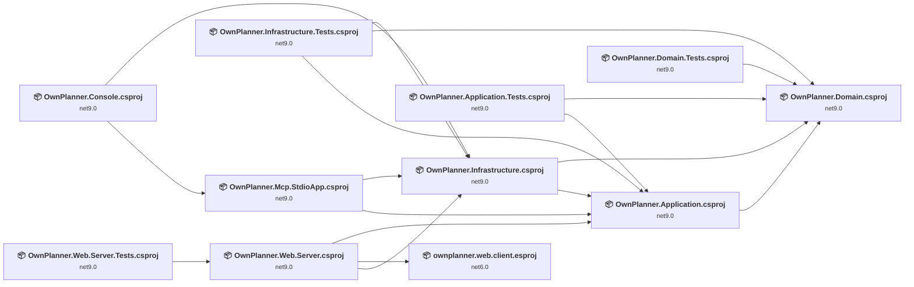

## Project Details

### OwnPlanner.Application.Tests\OwnPlanner.Application.Tests.csproj

#### Project Info

- **Current Target Framework:** net9.0
- **Proposed Target Framework:** net10.0
- **SDK-style**: True
- **Project Kind:** DotNetCoreApp
- **Dependencies**: 2
- **Dependants**: 0
- **Number of Files**: 9
- **Number of Files with Incidents**: 1
- **Lines of Code**: 1667
- **Estimated LOC to modify**: 0+ (at least 0.0% of the project)

#### Dependency Graph

Legend:
📦 SDK-style project
⚙️ Classic project

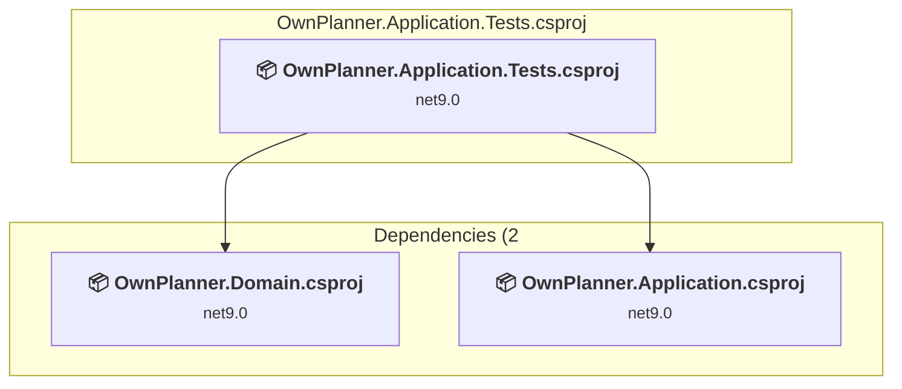

### API Compatibility

| Category | Count | Impact |
| :--- | :---: | :--- |
| 🔴 Binary Incompatible | 0 | High - Require code changes |
| 🟡 Source Incompatible | 0 | Medium - Needs re-compilation and potential conflicting API error fixing |
| 🔵 Behavioral change | 0 | Low - Behavioral changes that may require testing at runtime |
| ✅ Compatible | 3556 |  |
| ***Total APIs Analyzed*** | ***3556*** |  |

### OwnPlanner.Application\OwnPlanner.Application.csproj

#### Project Info

- **Current Target Framework:** net9.0
- **Proposed Target Framework:** net10.0
- **SDK-style**: True
- **Project Kind:** ClassLibrary
- **Dependencies**: 1
- **Dependants**: 5
- **Number of Files**: 29
- **Number of Files with Incidents**: 1
- **Lines of Code**: 1318
- **Estimated LOC to modify**: 0+ (at least 0.0% of the project)

#### Dependency Graph

Legend:
📦 SDK-style project
⚙️ Classic project

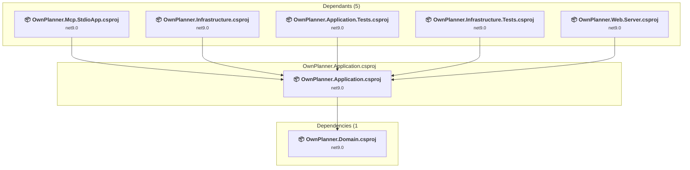

### API Compatibility

| Category | Count | Impact |
| :--- | :---: | :--- |
| 🔴 Binary Incompatible | 0 | High - Require code changes |
| 🟡 Source Incompatible | 0 | Medium - Needs re-compilation and potential conflicting API error fixing |
| 🔵 Behavioral change | 0 | Low - Behavioral changes that may require testing at runtime |
| ✅ Compatible | 1663 |  |
| ***Total APIs Analyzed*** | ***1663*** |  |

### OwnPlanner.Console\OwnPlanner.Console.csproj

#### Project Info

- **Current Target Framework:** net9.0
- **Proposed Target Framework:** net10.0
- **SDK-style**: True
- **Project Kind:** DotNetCoreApp
- **Dependencies**: 2
- **Dependants**: 0
- **Number of Files**: 3
- **Number of Files with Incidents**: 2
- **Lines of Code**: 578
- **Estimated LOC to modify**: 1+ (at least 0.2% of the project)

#### Dependency Graph

Legend:
📦 SDK-style project
⚙️ Classic project

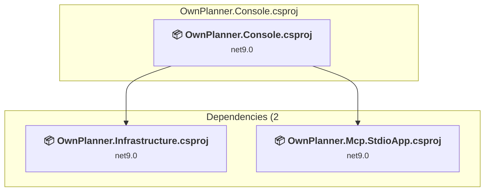

### API Compatibility

| Category | Count | Impact |
| :--- | :---: | :--- |
| 🔴 Binary Incompatible | 1 | High - Require code changes |
| 🟡 Source Incompatible | 0 | Medium - Needs re-compilation and potential conflicting API error fixing |
| 🔵 Behavioral change | 0 | Low - Behavioral changes that may require testing at runtime |
| ✅ Compatible | 705 |  |
| ***Total APIs Analyzed*** | ***706*** |  |

### OwnPlanner.Domain.Tests\OwnPlanner.Domain.Tests.csproj

#### Project Info

- **Current Target Framework:** net9.0
- **Proposed Target Framework:** net10.0
- **SDK-style**: True
- **Project Kind:** DotNetCoreApp
- **Dependencies**: 1
- **Dependants**: 0
- **Number of Files**: 5
- **Number of Files with Incidents**: 1
- **Lines of Code**: 429
- **Estimated LOC to modify**: 0+ (at least 0.0% of the project)

#### Dependency Graph

Legend:
📦 SDK-style project
⚙️ Classic project

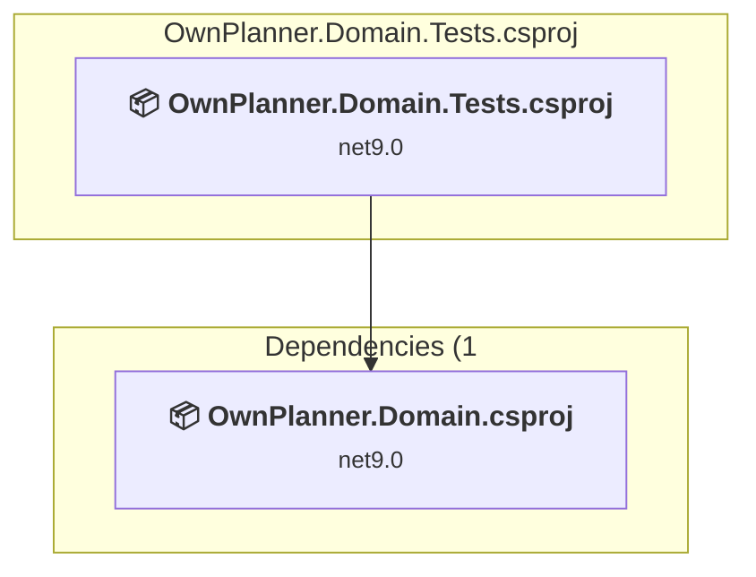

### API Compatibility

| Category | Count | Impact |
| :--- | :---: | :--- |
| 🔴 Binary Incompatible | 0 | High - Require code changes |
| 🟡 Source Incompatible | 0 | Medium - Needs re-compilation and potential conflicting API error fixing |
| 🔵 Behavioral change | 0 | Low - Behavioral changes that may require testing at runtime |
| ✅ Compatible | 718 |  |
| ***Total APIs Analyzed*** | ***718*** |  |

### OwnPlanner.Domain\OwnPlanner.Domain.csproj

#### Project Info

- **Current Target Framework:** net9.0
- **Proposed Target Framework:** net10.0
- **SDK-style**: True
- **Project Kind:** ClassLibrary
- **Dependencies**: 0
- **Dependants**: 5
- **Number of Files**: 20
- **Number of Files with Incidents**: 1
- **Lines of Code**: 748
- **Estimated LOC to modify**: 0+ (at least 0.0% of the project)

#### Dependency Graph

Legend:
📦 SDK-style project
⚙️ Classic project

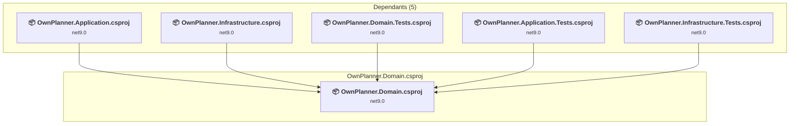

### API Compatibility

| Category | Count | Impact |
| :--- | :---: | :--- |
| 🔴 Binary Incompatible | 0 | High - Require code changes |
| 🟡 Source Incompatible | 0 | Medium - Needs re-compilation and potential conflicting API error fixing |
| 🔵 Behavioral change | 0 | Low - Behavioral changes that may require testing at runtime |
| ✅ Compatible | 914 |  |
| ***Total APIs Analyzed*** | ***914*** |  |

### OwnPlanner.Infrastructure.Tests\OwnPlanner.Infrastructure.Tests.csproj

#### Project Info

- **Current Target Framework:** net9.0
- **Proposed Target Framework:** net10.0
- **SDK-style**: True
- **Project Kind:** DotNetCoreApp
- **Dependencies**: 3
- **Dependants**: 0
- **Number of Files**: 8
- **Number of Files with Incidents**: 1
- **Lines of Code**: 1099
- **Estimated LOC to modify**: 0+ (at least 0.0% of the project)

#### Dependency Graph

Legend:
📦 SDK-style project
⚙️ Classic project

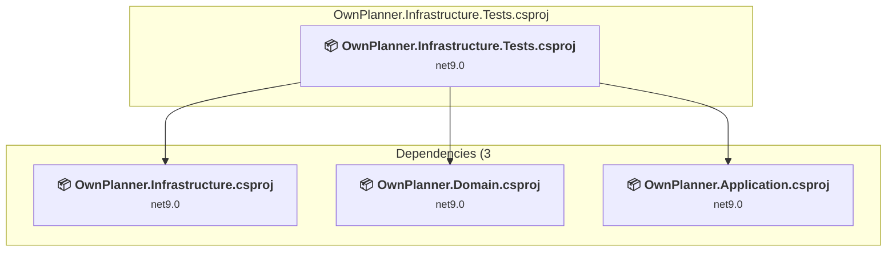

### API Compatibility

| Category | Count | Impact |
| :--- | :---: | :--- |
| 🔴 Binary Incompatible | 0 | High - Require code changes |
| 🟡 Source Incompatible | 0 | Medium - Needs re-compilation and potential conflicting API error fixing |
| 🔵 Behavioral change | 0 | Low - Behavioral changes that may require testing at runtime |
| ✅ Compatible | 1421 |  |
| ***Total APIs Analyzed*** | ***1421*** |  |

### OwnPlanner.Infrastructure\OwnPlanner.Infrastructure.csproj

#### Project Info

- **Current Target Framework:** net9.0
- **Proposed Target Framework:** net10.0
- **SDK-style**: True
- **Project Kind:** ClassLibrary
- **Dependencies**: 2
- **Dependants**: 4
- **Number of Files**: 33
- **Number of Files with Incidents**: 1
- **Lines of Code**: 3720
- **Estimated LOC to modify**: 0+ (at least 0.0% of the project)

#### Dependency Graph

Legend:
📦 SDK-style project
⚙️ Classic project

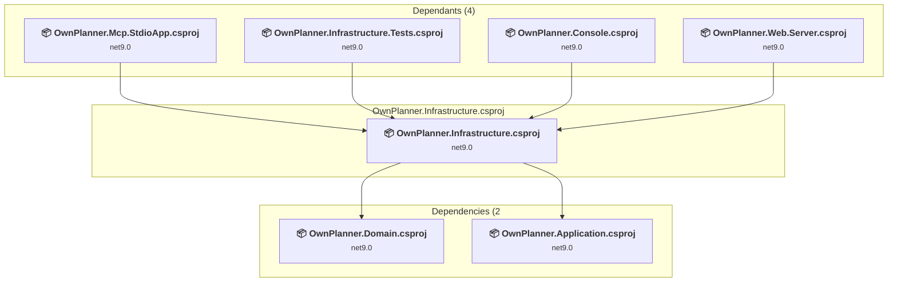

### API Compatibility

| Category | Count | Impact |
| :--- | :---: | :--- |
| 🔴 Binary Incompatible | 0 | High - Require code changes |
| 🟡 Source Incompatible | 0 | Medium - Needs re-compilation and potential conflicting API error fixing |
| 🔵 Behavioral change | 0 | Low - Behavioral changes that may require testing at runtime |
| ✅ Compatible | 5014 |  |
| ***Total APIs Analyzed*** | ***5014*** |  |

### OwnPlanner.Mcp.StdioApp\OwnPlanner.Mcp.StdioApp.csproj

#### Project Info

- **Current Target Framework:** net9.0
- **Proposed Target Framework:** net10.0
- **SDK-style**: True
- **Project Kind:** DotNetCoreApp
- **Dependencies**: 2
- **Dependants**: 1
- **Number of Files**: 8
- **Number of Files with Incidents**: 1
- **Lines of Code**: 1025
- **Estimated LOC to modify**: 0+ (at least 0.0% of the project)

#### Dependency Graph

Legend:
📦 SDK-style project
⚙️ Classic project

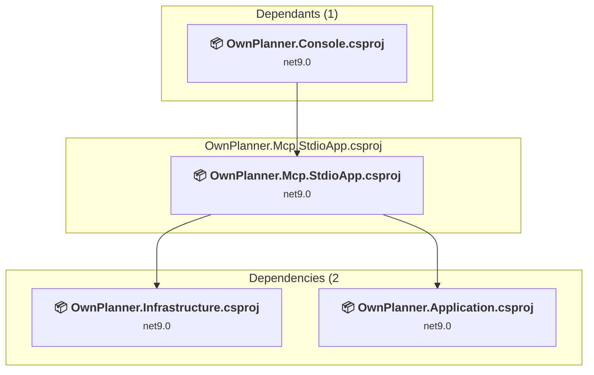

### API Compatibility

| Category | Count | Impact |
| :--- | :---: | :--- |
| 🔴 Binary Incompatible | 0 | High - Require code changes |
| 🟡 Source Incompatible | 0 | Medium - Needs re-compilation and potential conflicting API error fixing |
| 🔵 Behavioral change | 0 | Low - Behavioral changes that may require testing at runtime |
| ✅ Compatible | 1020 |  |
| ***Total APIs Analyzed*** | ***1020*** |  |

### OwnPlanner.Web.Server.Tests\OwnPlanner.Web.Server.Tests.csproj

#### Project Info

- **Current Target Framework:** net9.0
- **Proposed Target Framework:** net10.0
- **SDK-style**: True
- **Project Kind:** DotNetCoreApp
- **Dependencies**: 1
- **Dependants**: 0
- **Number of Files**: 4
- **Number of Files with Incidents**: 1
- **Lines of Code**: 310
- **Estimated LOC to modify**: 0+ (at least 0.0% of the project)

#### Dependency Graph

Legend:
📦 SDK-style project
⚙️ Classic project

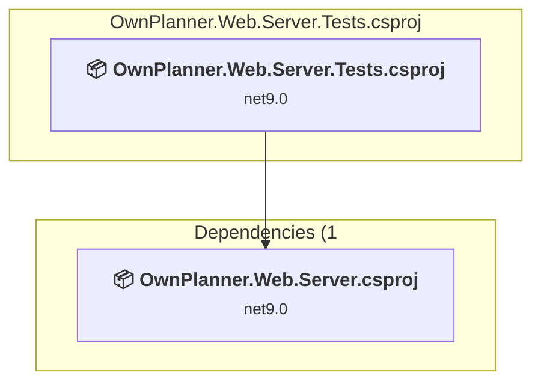

### API Compatibility

| Category | Count | Impact |
| :--- | :---: | :--- |
| 🔴 Binary Incompatible | 0 | High - Require code changes |
| 🟡 Source Incompatible | 0 | Medium - Needs re-compilation and potential conflicting API error fixing |
| 🔵 Behavioral change | 0 | Low - Behavioral changes that may require testing at runtime |
| ✅ Compatible | 529 |  |
| ***Total APIs Analyzed*** | ***529*** |  |

### OwnPlanner.Web\ownplanner.web.client\ownplanner.web.client.esproj

#### Project Info

- **Current Target Framework:** net6.0
- **Proposed Target Framework:** net10.0
- **SDK-style**: True
- **Project Kind:** DotNetCoreApp
- **Dependencies**: 0
- **Dependants**: 1
- **Number of Files**: 0
- **Number of Files with Incidents**: 1
- **Lines of Code**: 0
- **Estimated LOC to modify**: 0+ (at least 0.0% of the project)

#### Dependency Graph

Legend:
📦 SDK-style project
⚙️ Classic project

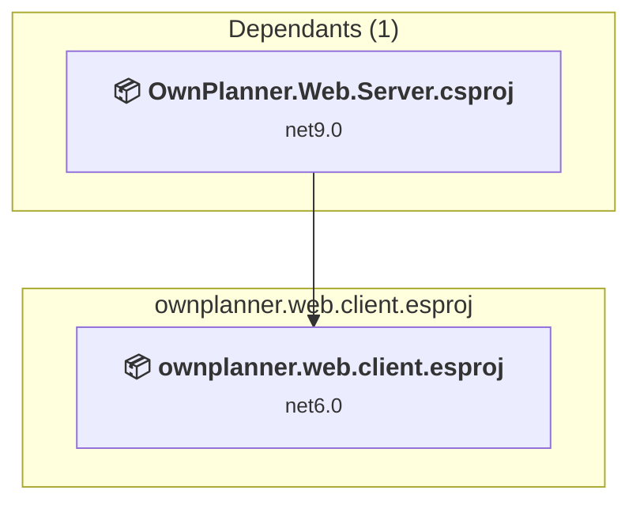

### API Compatibility

| Category | Count | Impact |
| :--- | :---: | :--- |
| 🔴 Binary Incompatible | 0 | High - Require code changes |
| 🟡 Source Incompatible | 0 | Medium - Needs re-compilation and potential conflicting API error fixing |
| 🔵 Behavioral change | 0 | Low - Behavioral changes that may require testing at runtime |
| ✅ Compatible | 0 |  |
| ***Total APIs Analyzed*** | ***0*** |  |

### OwnPlanner.Web\OwnPlanner.Web.Server\OwnPlanner.Web.Server.csproj

#### Project Info

- **Current Target Framework:** net9.0
- **Proposed Target Framework:** net10.0
- **SDK-style**: True
- **Project Kind:** AspNetCore
- **Dependencies**: 3
- **Dependants**: 1
- **Number of Files**: 14
- **Number of Files with Incidents**: 4
- **Lines of Code**: 1031
- **Estimated LOC to modify**: 9+ (at least 0.9% of the project)

#### Dependency Graph

Legend:
📦 SDK-style project
⚙️ Classic project

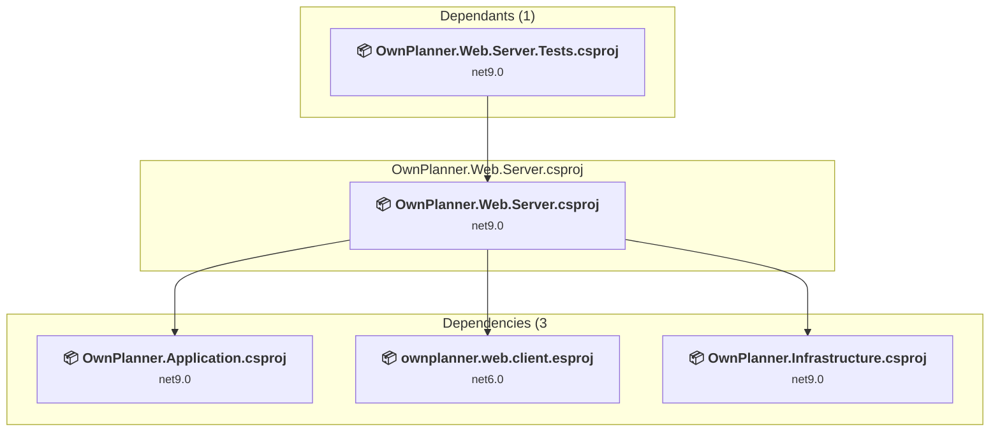

### API Compatibility

| Category | Count | Impact |
| :--- | :---: | :--- |
| 🔴 Binary Incompatible | 1 | High - Require code changes |
| 🟡 Source Incompatible | 6 | Medium - Needs re-compilation and potential conflicting API error fixing |
| 🔵 Behavioral change | 2 | Low - Behavioral changes that may require testing at runtime |
| ✅ Compatible | 1283 |  |
| ***Total APIs Analyzed*** | ***1292*** |  |

