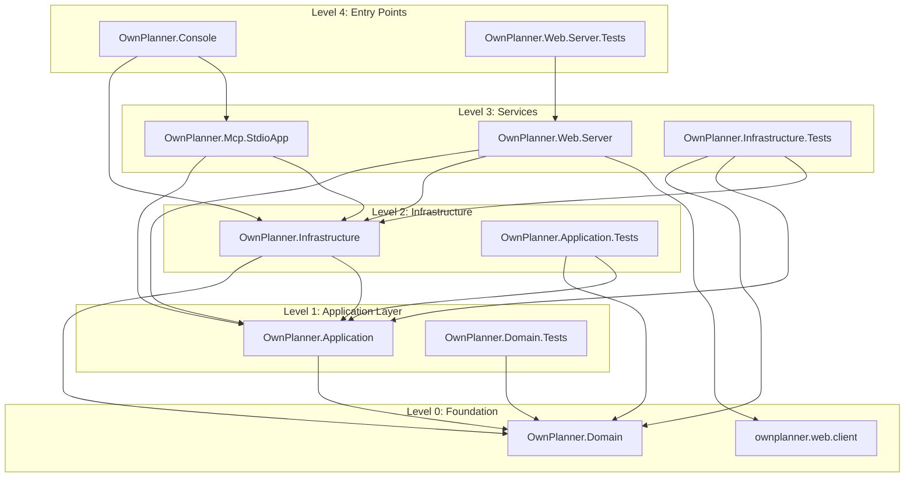

# .NET 10 Upgrade Plan - OwnPlanner Solution

## Table of Contents
- [Executive Summary](#executive-summary)
- [Migration Strategy](#migration-strategy)
- [Detailed Dependency Analysis](#detailed-dependency-analysis)
- [Project-by-Project Migration Plans](#project-by-project-migration-plans)
- [Package Update Reference](#package-update-reference)
- [Breaking Changes Catalog](#breaking-changes-catalog)
- [Risk Management](#risk-management)
- [Testing & Validation Strategy](#testing--validation-strategy)
- [Complexity & Effort Assessment](#complexity--effort-assessment)
- [Source Control Strategy](#source-control-strategy)
- [Success Criteria](#success-criteria)

---

## Executive Summary

### Scenario
Upgrade the entire OwnPlanner solution from .NET 9.0 (and one project from .NET 6.0) to .NET 10.0 (LTS).

### Scope
- **11 projects** across the solution
- **Current state**: 10 projects on `net9.0`, 1 web client project on `net6.0`
- **Target state**: All projects upgraded to `net10.0`

### Selected Strategy
**All-At-Once Strategy** - All projects upgraded simultaneously in a single coordinated operation.

**Rationale**: 
- Medium-sized solution (11 projects)
- All projects currently on modern .NET (6.0 or 9.0)
- Clear dependency structure with 4 levels, no circular dependencies
- Most packages have compatible versions for .NET 10
- Faster completion with coordinated upgrade approach

### Discovered Metrics
- **Projects**: 11
- **Total Issues**: 37 (15 mandatory, 22 potential, 0 optional)
- **Affected Files**: 15
- **Dependency Depth**: 4 levels
- **Security Vulnerabilities**: None
- **Circular Dependencies**: None

### Complexity Assessment
**Medium Complexity** with focused high-risk areas:

**High-Risk Projects** (3):
1. **OwnPlanner.Web.Server** - 14 issues (1 binary incompatible API, 6 source incompatible APIs, 2 behavioral changes, incompatible packages)
2. **OwnPlanner.Mcp.StdioApp** - 5 issues (incompatible packages requiring replacement)
3. **OwnPlanner.Console** - 5 issues (1 binary incompatible API)

**Medium-Risk Projects** (3):
- OwnPlanner.Infrastructure (3 issues)
- OwnPlanner.Infrastructure.Tests (3 issues)
- OwnPlanner.Application (2 issues)

**Low-Risk Projects** (5):
- OwnPlanner.Domain, OwnPlanner.Domain.Tests, OwnPlanner.Application.Tests, OwnPlanner.Web.Server.Tests, ownplanner.web.client (1 issue each - framework update only)

### Critical Issues
- **Incompatible NuGet packages**: 2 packages require updates or replacements
- **Binary incompatible APIs**: 2 occurrences (require code changes)
- **Source incompatible APIs**: 6 occurrences (may require fixes after compilation)
- **Behavioral changes**: 2 APIs with runtime behavior changes needing validation
- **Package upgrades**: 14 packages recommended for update

### Recommended Approach
**All-At-Once atomic upgrade** with the following execution sequence:
1. Update all project files to `net10.0` simultaneously
2. Update all package references in one coordinated operation
3. Restore dependencies
4. Build solution and address all compilation errors
5. Execute comprehensive test suite
6. Validate application behavior

### Iteration Strategy
Phase-based detail generation:
- **Phase 1**: Foundation projects (Level 0)
- **Phase 2**: Core libraries (Level 1)
- **Phase 3**: Infrastructure and high-risk projects (Levels 2-3)
- **Phase 4**: Top-level applications and tests (Level 4)
- **Final**: Success criteria and source control strategy

## Migration Strategy

### Approach Selection: All-At-Once Strategy

#### Why All-At-Once?

**Solution Characteristics Favoring This Approach:**
1. **Medium-sized solution**: 11 projects is manageable for simultaneous upgrade
2. **Modern baseline**: All projects already on .NET 6.0 or 9.0, making the jump to 10.0 incremental
3. **Clear dependency structure**: 4-level hierarchy with no circular dependencies simplifies understanding
4. **Package compatibility**: Most packages have clear upgrade paths or are compatible with .NET 10
5. **Unified codebase**: All projects maintained by same team, coordinated upgrade is feasible

**Benefits:**
- ✅ Fastest completion time - single coordinated operation
- ✅ No multi-targeting complexity - all projects move forward together
- ✅ Clean dependency resolution - no mixed framework versions
- ✅ Simplified testing - test against single target framework
- ✅ All projects benefit from .NET 10 improvements simultaneously

**Trade-offs:**
- ⚠️ Higher initial risk - all projects change at once
- ⚠️ Larger testing surface - must validate entire solution
- ⚠️ All breaking changes addressed in single pass

**Risk Mitigation:**
- Comprehensive test suite execution after upgrade
- Systematic breaking change catalog for targeted fixes
- Build verification before and after code changes
- Clear rollback plan via source control

### Dependency-Based Ordering Rationale

While the All-At-Once strategy updates all projects simultaneously, we still respect dependency order for **understanding and validation**:

1. **Foundation Projects** (Level 0) form the base - changes here impact the most projects
2. **Core Libraries** (Levels 1-2) build on the foundation - intermediate impact
3. **Services and Applications** (Levels 3-4) consume the libraries - localized impact

This ordering informs:
- **Breaking change analysis**: Foundation changes propagate upward
- **Build error prioritization**: Fix lower-level issues first
- **Testing sequence**: Validate foundation before higher-level integrations

### Execution Approach: Atomic Upgrade

**Single Coordinated Operation:**

All project files and package references are updated together, creating no intermediate states where some projects are on .NET 9 while others are on .NET 10.

**Operation Sequence:**
1. **Update all project files** (`TargetFramework` property in all 11 .csproj/.esproj files)
2. **Update all package references** (across all projects per package update reference)
3. **Restore dependencies** (`dotnet restore` at solution level)
4. **Build solution** to identify compilation errors
5. **Fix all compilation errors** using breaking changes catalog
6. **Rebuild solution** to verify all fixes applied
7. **Execute all tests** to validate behavior
8. **Verify solution** builds with 0 errors and all tests pass

**Key Principle**: These operations are interdependent and must be executed as a cohesive unit. You cannot verify project file updates without updating packages; you cannot validate package updates without building; compilation errors only surface after building with new packages.

### Parallel vs Sequential Execution

**Within the atomic upgrade task:**
- Project file updates: Can be applied in parallel (no interdependencies)
- Package updates: Can be applied in parallel (no interdependencies)
- Build: Sequential (single solution build)
- Error fixing: May be parallelized by project/area if multiple developers available
- Testing: Can be parallelized by test project

**Recommendation**: Given the medium complexity and 3 high-risk projects, consider:
- Single developer: Execute all operations sequentially
- Multiple developers: Parallelize error fixing across high-risk projects after initial build

### Phase Definitions

For organizational clarity, the migration is conceptually divided into phases, though executed atomically:

#### Phase 0: Preparation
- Verify .NET 10 SDK installed
- Confirm all developers on correct branch (`upgrade-to-NET10`)
- Ensure clean working directory

#### Phase 1: Atomic Framework and Package Upgrade
**Operations** (performed as single coordinated batch):
1. Update all 11 project files to `net10.0`
2. Update all package references per package update reference
3. Restore dependencies
4. Build solution and fix all compilation errors (reference breaking changes catalog)
5. Solution builds with 0 errors (verification point)

**Deliverables**: 
- All projects targeting `net10.0`
- All packages updated
- Solution builds successfully

#### Phase 2: Comprehensive Testing and Validation
**Operations**:
1. Execute all 5 test projects
2. Address any test failures
3. Validate application behavior (smoke tests)

**Deliverables**: 
- All tests pass
- Applications run correctly
- No functional regressions

### Breaking Change Resolution Strategy

**Systematic Approach:**
1. **Build first**: Let compiler identify issues
2. **Categorize errors**: Binary incompatible, source incompatible, package conflicts
3. **Fix by category**: Apply consistent patterns across similar issues
4. **Rebuild incrementally**: Verify fixes as applied
5. **Address behavioral changes**: Validate at runtime via tests

**Focus Areas** (based on assessment):
- **OwnPlanner.Web.Server**: Binary/source incompatibilities, behavioral changes (highest attention)
- **OwnPlanner.Mcp.StdioApp**: Incompatible package replacements
- **OwnPlanner.Console**: Binary incompatible APIs
- **Other projects**: Package version updates, minor compatibility issues

## Detailed Dependency Analysis

### Dependency Graph Summary

The OwnPlanner solution has a clean, hierarchical dependency structure with **4 levels** and **no circular dependencies**, making it ideal for the All-At-Once strategy.



### Project Groupings by Migration Phase

Since we're using the **All-At-Once strategy**, all projects will be upgraded simultaneously. However, we organize them by dependency level for understanding:

#### Level 0: Foundation (No Dependencies)
- **OwnPlanner.Domain** - Core domain entities and business rules
  - Issues: 1 (TargetFramework update)
  - Risk: Low
  - Used by: 5 projects

- **ownplanner.web.client** - React/TypeScript SPA frontend (`.esproj` — Visual Studio SPA tooling project)
  - Issues: 1 (`TargetFramework` tooling marker update from `net6.0`, not a real .NET version change)
  - Risk: Low
  - Used by: 1 project (Web.Server via SpaProxy)

#### Level 1: Application Layer
- **OwnPlanner.Application** - Use cases, services, DTOs
  - Issues: 2 (TargetFramework + package upgrades)
  - Risk: Medium
  - Used by: 5 projects

- **OwnPlanner.Domain.Tests** - Domain unit tests
  - Issues: 1 (TargetFramework update)
  - Risk: Low
  - Used by: None (test project)

#### Level 2: Infrastructure Layer
- **OwnPlanner.Infrastructure** - Persistence, SQLite, external integrations
  - Issues: 3 (TargetFramework + package upgrades)
  - Risk: Medium
  - Used by: 4 projects

- **OwnPlanner.Application.Tests** - Application layer tests
  - Issues: 1 (TargetFramework update)
  - Risk: Low
  - Used by: None (test project)

#### Level 3: Service Layer
- **OwnPlanner.Mcp.StdioApp** - MCP stdio host for tool execution
  - Issues: 5 (TargetFramework + incompatible packages + package upgrades)
  - Risk: **High** (incompatible packages)
  - Used by: 1 project (Console)

- **OwnPlanner.Web.Server** - ASP.NET Core web server and API
  - Issues: 14 (TargetFramework + binary/source incompatibilities + behavioral changes + incompatible packages)
  - Risk: **High** (most complex upgrade)
  - Used by: 1 project (Web.Server.Tests)

- **OwnPlanner.Infrastructure.Tests** - Infrastructure tests
  - Issues: 3 (TargetFramework + package upgrades)
  - Risk: Medium
  - Used by: None (test project)

#### Level 4: Entry Points
- **OwnPlanner.Console** - CLI entry point
  - Issues: 5 (TargetFramework + binary incompatibility + package upgrades)
  - Risk: **High** (binary incompatible APIs)
  - Used by: None (entry point)

- **OwnPlanner.Web.Server.Tests** - Web server tests
  - Issues: 1 (TargetFramework update)
  - Risk: Low
  - Used by: None (test project)

### Critical Path Identification

**Critical dependencies** (projects with many dependants):
1. **OwnPlanner.Domain** → Used by 5 projects (most critical)
2. **OwnPlanner.Application** → Used by 5 projects
3. **OwnPlanner.Infrastructure** → Used by 4 projects

These form the **foundation** that other projects build upon. However, since we're upgrading all projects simultaneously, the critical path consideration is primarily for understanding impact scope, not sequential ordering.

### All-At-Once Execution Principle

In this strategy:
- **All 11 projects** will have their `TargetFramework` updated in a single operation
- **All package references** will be updated simultaneously across all projects
- **All breaking changes** will be addressed in one consolidated effort
- The dependency structure helps us understand **impact scope** but doesn't dictate sequential execution

## Project-by-Project Migration Plans

### OwnPlanner.Domain
**Current State**: `net9.0`, ClassLibrary, 0 dependencies, 1 issue  
**Target State**: `net10.0`

#### Migration Steps

1. **Prerequisites**: None - foundation project with no dependencies

2. **Framework Update**
   - Update `TargetFramework` from `net9.0` to `net10.0` in `OwnPlanner.Domain.csproj`

3. **Package Updates**: None required

4. **Expected Breaking Changes**: None

5. **Code Modifications**: None expected

6. **Testing Strategy**
   - Unit tests in `OwnPlanner.Domain.Tests` project
   - All domain entity tests must pass
   - Business rule validation tests must pass

7. **Validation Checklist**
   - [ ] Project file updated to `net10.0`
   - [ ] Project builds without errors
   - [ ] Project builds without warnings
   - [ ] All domain tests pass
   - [ ] No breaking changes to public API (used by 5 projects)

---

### ownplanner.web.client
**Current State**: `net6.0` (tooling marker only), React/TypeScript SPA (`.esproj`), 0 dependencies, 1 issue  
**Target State**: `net10.0` (tooling marker only)

> ⚠️ **Note**: `ownplanner.web.client` is a **React web application** (TypeScript/npm), not a .NET application. The `.esproj` file format is used by Visual Studio's JavaScript project system for SPA integration. The `TargetFramework` value inside it (`net6.0`) is purely a **Visual Studio tooling marker** that controls the ASP.NET Core SPA development proxy (`Microsoft.AspNetCore.SpaProxy`) compatibility — it has **no effect on the React runtime, npm packages, or TypeScript code**. Updating it to `net10.0` simply aligns the VS tooling integration version with the rest of the solution.

#### Migration Steps

1. **Prerequisites**: None

2. **Framework Update (Tooling Marker Only)**
   - Update `TargetFramework` from `net6.0` to `net10.0` in `ownplanner.web.client.esproj`
   - This is a single-line change affecting Visual Studio build tooling only

3. **Package Updates**: None — npm packages are managed separately via `package.json` and are unaffected

4. **Expected Breaking Changes**: None — React/TypeScript code is not .NET code and is unaffected

5. **Code Modifications**: None

6. **Testing Strategy**
   - Verify the esproj builds within Visual Studio without errors
   - Manual testing: Ensure frontend application still loads and renders correctly after the SPA proxy tooling update

7. **Validation Checklist**
   - [ ] `TargetFramework` in `.esproj` updated to `net10.0`
   - [ ] Project builds without errors
   - [ ] SPA development proxy (`Microsoft.AspNetCore.SpaProxy`) works correctly
   - [ ] Frontend application serves and renders correctly

---

### OwnPlanner.Application
**Current State**: `net9.0`, ClassLibrary, 1 dependency (Domain), 2 issues  
**Target State**: `net10.0`

#### Migration Steps

1. **Prerequisites**: 
   - `OwnPlanner.Domain` upgraded to `net10.0` (Level 0 dependency)

2. **Framework Update**
   - Update `TargetFramework` from `net9.0` to `net10.0` in `OwnPlanner.Application.csproj`

3. **Package Updates**

| Package | Current Version | Target Version | Reason |
|---------|----------------|----------------|--------|
| Microsoft.Extensions.Logging.Abstractions | 10.0.0 | 10.0.5 | Recommended upgrade for .NET 10 |\n| BCrypt.Net-Next | 4.0.3 | 4.0.3 | ✅ Compatible (no change) |

4. **Expected Breaking Changes**: None expected

5. **Code Modifications**: 
   - None expected - logging abstractions typically backward compatible
   - Review any direct usage of logging extension methods if build errors occur

6. **Testing Strategy**
   - Unit tests in `OwnPlanner.Application.Tests` project
   - All service layer tests must pass
   - Verify dependency injection still works correctly

7. **Validation Checklist**
   - [ ] Project file updated to `net10.0`
   - [ ] `Microsoft.Extensions.Logging.Abstractions` updated to `10.0.5`
   - [ ] Project builds without errors
   - [ ] Project builds without warnings
   - [ ] All application tests pass
   - [ ] No breaking changes to public API (used by 5 projects)

---

### OwnPlanner.Domain.Tests
**Current State**: `net9.0`, Test project, 1 dependency (Domain), 1 issue  
**Target State**: `net10.0`

#### Migration Steps

1. **Prerequisites**: 
   - `OwnPlanner.Domain` upgraded to `net10.0` (test target)

2. **Framework Update**
   - Update `TargetFramework` from `net9.0` to `net10.0` in `OwnPlanner.Domain.Tests.csproj`

3. **Package Updates**: None required (test packages compatible)

4. **Expected Breaking Changes**: None

5. **Code Modifications**: None expected

6. **Testing Strategy**
   - Execute all domain unit tests
   - Verify xUnit test discovery and execution works
   - Validate FluentAssertions compatibility

7. **Validation Checklist**
   - [ ] Project file updated to `net10.0`
   - [ ] Project builds without errors
   - [ ] Project builds without warnings
   - [ ] All tests discovered by test runner
   - [ ] All tests pass

### OwnPlanner.Infrastructure
**Current State**: `net9.0`, ClassLibrary, 2 dependencies (Domain, Application), 3 issues  
**Target State**: `net10.0`

#### Migration Steps

1. **Prerequisites**: 
   - `OwnPlanner.Domain` upgraded to `net10.0`
   - `OwnPlanner.Application` upgraded to `net10.0`

2. **Framework Update**
   - Update `TargetFramework` from `net9.0` to `net10.0` in `OwnPlanner.Infrastructure.csproj`

3. **Package Updates**

| Package | Current Version | Target Version | Reason |
|---------|----------------|----------------|--------|
| Microsoft.EntityFrameworkCore.Design | 9.0.10 | 10.0.5 | Recommended upgrade for .NET 10 |
| Microsoft.EntityFrameworkCore.Sqlite | 9.0.10 | 10.0.5 | Recommended upgrade for .NET 10 |
| ModelContextProtocol.Core | 0.4.0-preview.3 | 0.4.0-preview.3 | ✅ Compatible (no change) |
| Mscc.GenerativeAI.Microsoft | 2.8.25 | 2.8.25 | ✅ Compatible (no change) |
| Serilog | 4.3.0 | 4.3.0 | ✅ Compatible (no change) |

4. **Expected Breaking Changes**: 
   - Potential EF Core 10 API changes
   - Review migration generation if any breaking changes in design-time APIs

5. **Code Modifications**: 
   - Review `DbContext` configurations for EF Core 10 changes
   - Verify SQLite provider compatibility
   - Check if any EF Core extension methods changed signatures
   - Review migration files for compatibility

6. **Testing Strategy**
   - Unit tests in `OwnPlanner.Infrastructure.Tests` project
   - Integration tests for database operations
   - Verify migrations can be applied
   - Test SQLite database creation and seeding
   - Validate repository implementations

7. **Validation Checklist**
   - [ ] Project file updated to `net10.0`
   - [ ] EF Core packages updated to `10.0.5`
   - [ ] Project builds without errors
   - [ ] Project builds without warnings
   - [ ] All infrastructure tests pass
   - [ ] Database migrations work correctly
   - [ ] SQLite provider functions correctly
   - [ ] No breaking changes to public API (used by 4 projects)

---

### OwnPlanner.Application.Tests
**Current State**: `net9.0`, Test project, 2 dependencies (Domain, Application), 1 issue  
**Target State**: `net10.0`

#### Migration Steps

1. **Prerequisites**: 
   - `OwnPlanner.Domain` upgraded to `net10.0`
   - `OwnPlanner.Application` upgraded to `net10.0`

2. **Framework Update**
   - Update `TargetFramework` from `net9.0` to `net10.0` in `OwnPlanner.Application.Tests.csproj`

3. **Package Updates**: None required (all test packages compatible)

4. **Expected Breaking Changes**: None

5. **Code Modifications**: None expected

6. **Testing Strategy**
   - Execute all application layer tests
   - Verify service layer unit tests pass
   - Validate mocking framework (NSubstitute) compatibility

7. **Validation Checklist**
   - [ ] Project file updated to `net10.0`
   - [ ] Project builds without errors
   - [ ] Project builds without warnings
   - [ ] All tests discovered by test runner
   - [ ] All tests pass
   - [ ] NSubstitute mocks work correctly

---

### OwnPlanner.Infrastructure.Tests
**Current State**: `net9.0`, Test project, 3 dependencies (Domain, Application, Infrastructure), 3 issues  
**Target State**: `net10.0`

#### Migration Steps

1. **Prerequisites**: 
   - `OwnPlanner.Domain` upgraded to `net10.0`
   - `OwnPlanner.Application` upgraded to `net10.0`
   - `OwnPlanner.Infrastructure` upgraded to `net10.0`

2. **Framework Update**
   - Update `TargetFramework` from `net9.0` to `net10.0` in `OwnPlanner.Infrastructure.Tests.csproj`

3. **Package Updates**

| Package | Current Version | Target Version | Reason |
|---------|----------------|----------------|--------|
| Microsoft.Data.Sqlite | 9.0.0 | 10.0.5 | Recommended upgrade for .NET 10 |
| Microsoft.EntityFrameworkCore.Sqlite | 9.0.10 | 9.0.10 | ✅ Compatible (no change) |
| coverlet.collector | 6.0.2 | 6.0.2 | ✅ Compatible (no change) |
| FluentAssertions | 6.12.0 | 6.12.0 | ✅ Compatible (no change) |
| Microsoft.NET.Test.Sdk | 17.12.0 | 17.12.0 | ✅ Compatible (no change) |
| xunit | 2.9.2 | 2.9.2 | ✅ Compatible (no change) |
| xunit.runner.visualstudio | 2.8.2 | 2.8.2 | ✅ Compatible (no change) |

4. **Expected Breaking Changes**: None expected

5. **Code Modifications**: 
   - None expected
   - Review SQLite in-memory database setup if issues arise

6. **Testing Strategy**
   - Execute all infrastructure tests
   - Verify in-memory SQLite database tests work
   - Validate repository integration tests
   - Check EF Core test patterns still valid

7. **Validation Checklist**
   - [ ] Project file updated to `net10.0`
   - [ ] `Microsoft.Data.Sqlite` updated to `10.0.5`
   - [ ] Project builds without errors
   - [ ] Project builds without warnings
   - [ ] All tests discovered by test runner
   - [ ] All tests pass
   - [ ] In-memory database tests work correctly

### OwnPlanner.Mcp.StdioApp
**Current State**: `net9.0`, DotNetCoreApp, 2 dependencies (Application, Infrastructure), 5 issues  
**Target State**: `net10.0`

#### Migration Steps

1. **Prerequisites**: 
   - `OwnPlanner.Application` upgraded to `net10.0`
   - `OwnPlanner.Infrastructure` upgraded to `net10.0`

2. **Framework Update**
   - Update `TargetFramework` from `net9.0` to `net10.0` in `OwnPlanner.Mcp.StdioApp.csproj`

3. **Package Updates**

| Package | Current Version | Target Version | Reason |
|---------|----------------|----------------|--------|
| Microsoft.Extensions.DependencyInjection | 9.0.10 | 10.0.5 | Recommended upgrade for .NET 10 |
| Microsoft.Extensions.Hosting | 9.0.10 | 10.0.5 | Recommended upgrade for .NET 10 |
| Microsoft.Extensions.Logging.Console | 9.0.10 | 10.0.5 | Recommended upgrade for .NET 10 |
| Microsoft.VisualStudio.Azure.Containers.Tools.Targets | 1.22.1 | **REMOVE** | ⚠️ Incompatible with .NET 10 |
| ModelContextProtocol | 0.4.0-preview.3 | 0.4.0-preview.3 | ✅ Compatible (no change) |
| Serilog | 4.3.0 | 4.3.0 | ✅ Compatible (no change) |
| Serilog.Extensions.Hosting | 8.0.0 | 8.0.0 | ✅ Compatible (no change) |
| Serilog.Sinks.Console | 6.1.1 | 6.1.1 | ✅ Compatible (no change) |
| Serilog.Sinks.File | 7.0.0 | 7.0.0 | ✅ Compatible (no change) |

4. **Expected Breaking Changes**: 
   - **Incompatible package removal**: `Microsoft.VisualStudio.Azure.Containers.Tools.Targets` must be removed
     - This package provides Docker container support in Visual Studio
     - Not critical for runtime functionality
     - Can use Docker CLI or docker-compose directly if needed

5. **Code Modifications**: 
   - **Remove package reference**: Delete `Microsoft.VisualStudio.Azure.Containers.Tools.Targets` from .csproj
   - No code changes expected - package is build/tooling related
   - Verify MCP stdio protocol communication still works correctly
   - Review dependency injection setup for extension method changes

6. **Testing Strategy**
   - Manual testing: Verify MCP stdio communication works
   - Test tool execution through MCP protocol
   - Validate logging to console functions correctly
   - Check dependency injection container initialization

7. **Validation Checklist**
   - [ ] Project file updated to `net10.0`
   - [ ] `Microsoft.VisualStudio.Azure.Containers.Tools.Targets` removed
   - [ ] Microsoft.Extensions packages updated to `10.0.5`
   - [ ] Project builds without errors
   - [ ] Project builds without warnings
   - [ ] MCP stdio protocol works correctly
   - [ ] Tool execution functions as expected
   - [ ] Logging to console works

---

### OwnPlanner.Web.Server
**Current State**: `net9.0`, AspNetCore, 3 dependencies (Application, Infrastructure, web.client), 14 issues  
**Target State**: `net10.0`

#### Migration Steps

1. **Prerequisites**: 
   - `OwnPlanner.Application` upgraded to `net10.0`
   - `OwnPlanner.Infrastructure` upgraded to `net10.0`
   - `ownplanner.web.client` upgraded to `net10.0`

2. **Framework Update**
   - Update `TargetFramework` from `net9.0` to `net10.0` in `OwnPlanner.Web.Server.csproj`

3. **Package Updates**

| Package | Current Version | Target Version | Reason |
|---------|----------------|----------------|--------|
| Microsoft.AspNetCore.OpenApi | 9.0.11 | 10.0.5 | Recommended upgrade for .NET 10 |
| Microsoft.AspNetCore.SpaProxy | 9.*-* | 10.0.5 | Recommended upgrade for .NET 10 |
| Microsoft.EntityFrameworkCore.Sqlite | 9.0.* | 10.0.5 | Recommended upgrade for .NET 10 |
| Microsoft.VisualStudio.Azure.Containers.Tools.Targets | 1.23.0 | **REMOVE** | ⚠️ Incompatible with .NET 10 |
| Serilog.AspNetCore | 8.0.3 | 8.0.3 | ✅ Compatible (no change) |
| Serilog.Sinks.Console | 6.1.1 | 6.1.1 | ✅ Compatible (no change) |
| Serilog.Sinks.File | 7.0.0 | 7.0.0 | ✅ Compatible (no change) |

4. **Expected Breaking Changes**: 

**🔴 Binary Incompatible (Mandatory Code Change):**
- **File**: `Program.cs`, Line 57
- **API**: `OptionsConfigurationServiceCollectionExtensions.Configure<T>(IServiceCollection, IConfiguration)`
- **Issue**: Method signature changed in .NET 10
- **Fix**: Review method signature, may need to use alternative overload or add additional parameters

**🟡 Source Incompatible (Potential Code Changes):**
- **File**: `ChatSessionManager.cs`, Lines 25, 148
- **APIs**: `TimeSpan.FromSeconds(long)`, `TimeSpan.FromMinutes(long)`, `TimeSpan.FromDays(int)`
- **Issue**: Overloads may have changed, might cause compilation errors
- **Fix**: Cast to correct type if needed (e.g., `TimeSpan.FromSeconds((double)5)`)

- **File**: `Program.cs`, Line 72
- **API**: `TimeSpan.FromDays(int)`
- **Issue**: Same as above
- **Fix**: Cast to correct type if needed

**🔵 Behavioral Changes (Runtime Validation Required):**
- **File**: `Middleware\GlobalExceptionHandler.cs`, Line 10
- **API**: `IExceptionHandler` interface
- **Issue**: Behavior changed in .NET 10
- **Impact**: Exception handling behavior may differ
- **Validation**: Test error scenarios thoroughly

- **File**: `Program.cs`, Line 123
- **API**: `UseExceptionHandler()` extension method
- **Issue**: Behavior changed in .NET 10
- **Impact**: Exception middleware behavior may differ
- **Validation**: Test exception handling pipeline

**⚠️ Incompatible Package:**
- **Package**: `Microsoft.VisualStudio.Azure.Containers.Tools.Targets` must be removed
- Not critical for runtime, Docker can be used directly

5. **Code Modifications**: 

**Priority 1 - Fix compilation errors:**
```csharp
// File: Program.cs, Line 57
// OLD: builder.Services.Configure<ChatSettings>(builder.Configuration.GetSection("Chat"));
// NEW: Review ConfigureOptions method signature in .NET 10, may need:
builder.Services.Configure<ChatSettings>(options => 
    builder.Configuration.GetSection("Chat").Bind(options));
```

```csharp
// File: ChatSessionManager.cs, Lines 25, 148
// File: Program.cs, Line 72
// If compilation errors occur, cast integer literals to correct type:
// OLD: TimeSpan.FromSeconds(5)
// NEW: TimeSpan.FromSeconds(5.0) or TimeSpan.FromSeconds((double)5)
```

**Priority 2 - Validate behavioral changes:**
- Test exception handling in GlobalExceptionHandler
- Test UseExceptionHandler middleware
- Validate error responses match expected format

6. **Testing Strategy**
   - Unit tests in `OwnPlanner.Web.Server.Tests` project
   - Integration tests for API endpoints
   - **Critical**: Test exception handling scenarios
   - Validate SPA proxy functionality
   - Test chat session management with timeouts
   - Verify authentication/authorization
   - Test database operations through Web API

7. **Validation Checklist**
   - [ ] Project file updated to `net10.0`
   - [ ] All ASP.NET Core packages updated to `10.0.5`
   - [ ] `Microsoft.VisualStudio.Azure.Containers.Tools.Targets` removed
   - [ ] `OptionsConfigurationServiceCollectionExtensions.Configure` fixed
   - [ ] TimeSpan method calls fixed (if compilation errors)
   - [ ] Project builds without errors
   - [ ] Project builds without warnings
   - [ ] All web server tests pass
   - [ ] Exception handling tested and working correctly
   - [ ] API endpoints respond correctly
   - [ ] SPA frontend loads and renders
   - [ ] Authentication works
   - [ ] Chat sessions function correctly
   - [ ] No runtime exceptions in normal operation

### OwnPlanner.Infrastructure.Tests
**Current State**: `net9.0`, Test project, 3 dependencies (Domain, Application, Infrastructure), 3 issues  
**Target State**: `net10.0`

#### Migration Steps

1. **Prerequisites**: 
   - `OwnPlanner.Domain` upgraded to `net10.0`
   - `OwnPlanner.Application` upgraded to `net10.0`
   - `OwnPlanner.Infrastructure` upgraded to `net10.0`

2. **Framework Update**
   - Update `TargetFramework` from `net9.0` to `net10.0` in `OwnPlanner.Infrastructure.Tests.csproj`

3. **Package Updates**

| Package | Current Version | Target Version | Reason |
|---------|----------------|----------------|--------|
| Microsoft.Data.Sqlite | 9.0.0 | 10.0.5 | Recommended upgrade for .NET 10 |
| Microsoft.EntityFrameworkCore.Sqlite | 9.0.10 | 9.0.10 | ✅ Compatible (no change) |
| coverlet.collector | 6.0.2 | 6.0.2 | ✅ Compatible (no change) |
| FluentAssertions | 6.12.0 | 6.12.0 | ✅ Compatible (no change) |
| Microsoft.NET.Test.Sdk | 17.12.0 | 17.12.0 | ✅ Compatible (no change) |
| xunit | 2.9.2 | 2.9.2 | ✅ Compatible (no change) |
| xunit.runner.visualstudio | 2.8.2 | 2.8.2 | ✅ Compatible (no change) |

4. **Expected Breaking Changes**: None expected

5. **Code Modifications**: 
   - None expected
   - Review SQLite in-memory database setup if issues arise

6. **Testing Strategy**
   - Execute all infrastructure tests
   - Verify in-memory SQLite database tests work
   - Validate repository integration tests
   - Check EF Core test patterns still valid

7. **Validation Checklist**
   - [ ] Project file updated to `net10.0`
   - [ ] `Microsoft.Data.Sqlite` updated to `10.0.5`
   - [ ] Project builds without errors
   - [ ] Project builds without warnings
   - [ ] All tests discovered by test runner
   - [ ] All tests pass
   - [ ] In-memory database tests work correctly

---

### OwnPlanner.Console
**Current State**: `net9.0`, DotNetCoreApp, 2 dependencies (Infrastructure, Mcp.StdioApp), 5 issues  
**Target State**: `net10.0`

#### Migration Steps

1. **Prerequisites**: 
   - `OwnPlanner.Infrastructure` upgraded to `net10.0`
   - `OwnPlanner.Mcp.StdioApp` upgraded to `net10.0`

2. **Framework Update**
   - Update `TargetFramework` from `net9.0` to `net10.0` in `OwnPlanner.Console.csproj`

3. **Package Updates**

| Package | Current Version | Target Version | Reason |
|---------|----------------|----------------|--------|
| Microsoft.Extensions.Configuration.Binder | 9.0.10 | 10.0.5 | Recommended upgrade for .NET 10 |
| Microsoft.Extensions.Configuration.Json | 9.0.10 | 10.0.5 | Recommended upgrade for .NET 10 |
| Microsoft.Extensions.Logging.Abstractions | 10.0.0 | 10.0.5 | Recommended upgrade for .NET 10 |
| ModelContextProtocol.Core | 0.4.0-preview.3 | 0.4.0-preview.3 | ✅ Compatible (no change) |
| Mscc.GenerativeAI.Microsoft | 2.8.25 | 2.8.25 | ✅ Compatible (no change) |
| Serilog | 4.3.0 | 4.3.0 | ✅ Compatible (no change) |
| Serilog.Sinks.Console | 6.1.1 | 6.1.1 | ✅ Compatible (no change) |
| Serilog.Sinks.File | 7.0.0 | 7.0.0 | ✅ Compatible (no change) |
| Spectre.Console | 0.53.0 | 0.53.0 | ✅ Compatible (no change) |

4. **Expected Breaking Changes**: 

**🔴 Binary Incompatible (Mandatory Code Change):**
- **File**: `Program.cs`, Line 37
- **API**: `ConfigurationBinder.Get<T>(IConfiguration)`
- **Issue**: Method signature or behavior changed in .NET 10
- **Fix**: May need to use alternative method or add additional parameters

5. **Code Modifications**: 

**Priority 1 - Fix compilation error:**
```csharp
// File: Program.cs, Line 37
// OLD: var settings = configuration.Get<AppSettings>() ?? new AppSettings();
// NEW: Review ConfigurationBinder.Get signature in .NET 10
// Possible fixes:
// Option 1: Use Bind instead
var settings = new AppSettings();
configuration.Bind(settings);

// Option 2: Use GetValue pattern if appropriate
// Option 3: Check if additional parameters required in new overload
```

6. **Testing Strategy**
   - Manual CLI testing: Execute all console commands
   - Verify configuration loading works
   - Test Spectre.Console rendering
   - Validate MCP integration through console
   - Test all CLI command paths

7. **Validation Checklist**
   - [ ] Project file updated to `net10.0`
   - [ ] Microsoft.Extensions packages updated to `10.0.5`
   - [ ] `ConfigurationBinder.Get` fixed in Program.cs
   - [ ] Project builds without errors
   - [ ] Project builds without warnings
   - [ ] CLI application runs without crashes
   - [ ] All commands execute correctly
   - [ ] Configuration loads successfully
   - [ ] Console output renders correctly (Spectre.Console)
   - [ ] MCP integration works through console

---

### OwnPlanner.Web.Server.Tests
**Current State**: `net9.0`, Test project, 1 dependency (Web.Server), 1 issue  
**Target State**: `net10.0`

#### Migration Steps

1. **Prerequisites**: 
   - `OwnPlanner.Web.Server` upgraded to `net10.0` (all breaking changes addressed)

2. **Framework Update**
   - Update `TargetFramework` from `net9.0` to `net10.0` in `OwnPlanner.Web.Server.Tests.csproj`

3. **Package Updates**: None required (all test packages compatible)

4. **Expected Breaking Changes**: None

5. **Code Modifications**: None expected

6. **Testing Strategy**
   - Execute all web server tests
   - Verify API integration tests pass
   - Validate authentication/authorization tests
   - Check controller tests work correctly

7. **Validation Checklist**
   - [ ] Project file updated to `net10.0`
   - [ ] Project builds without errors
   - [ ] Project builds without warnings
   - [ ] All tests discovered by test runner
   - [ ] All tests pass
   - [ ] API integration tests work correctly

## Package Update Reference

This section provides a consolidated view of all package updates required across the solution for the .NET 10 upgrade.

### Packages Requiring Updates

| Package | Current Version(s) | Target Version | Projects Affected | Update Reason |
|---------|-------------------|----------------|-------------------|---------------|
| **Microsoft.EntityFrameworkCore.Design** | 9.0.10 | 10.0.5 | Infrastructure | Framework compatibility |
| **Microsoft.EntityFrameworkCore.Sqlite** | 9.0.10, 9.0.* | 10.0.5 | Infrastructure, Web.Server | Framework compatibility |
| **Microsoft.Data.Sqlite** | 9.0.0 | 10.0.5 | Infrastructure.Tests | Framework compatibility |
| **Microsoft.AspNetCore.OpenApi** | 9.0.11 | 10.0.5 | Web.Server | Framework compatibility |
| **Microsoft.AspNetCore.SpaProxy** | 9.*-* | 10.0.5 | Web.Server | Framework compatibility |
| **Microsoft.Extensions.Logging.Abstractions** | 10.0.0 | 10.0.5 | Application, Console | Version alignment |
| **Microsoft.Extensions.Configuration.Binder** | 9.0.10 | 10.0.5 | Console | Framework compatibility |
| **Microsoft.Extensions.Configuration.Json** | 9.0.10 | 10.0.5 | Console | Framework compatibility |
| **Microsoft.Extensions.DependencyInjection** | 9.0.10 | 10.0.5 | Mcp.StdioApp | Framework compatibility |
| **Microsoft.Extensions.Hosting** | 9.0.10 | 10.0.5 | Mcp.StdioApp | Framework compatibility |
| **Microsoft.Extensions.Logging.Console** | 9.0.10 | 10.0.5 | Mcp.StdioApp | Framework compatibility |

### Packages To Remove (Incompatible)

| Package | Current Version | Projects Affected | Reason | Alternative |
|---------|----------------|-------------------|--------|-------------|
| **Microsoft.VisualStudio.Azure.Containers.Tools.Targets** | 1.22.1, 1.23.0 | Mcp.StdioApp, Web.Server | No .NET 10 compatible version | Use Docker CLI or docker-compose directly |

### Compatible Packages (No Changes Required)

The following packages are compatible with .NET 10 and do not require version updates:

- **BCrypt.Net-Next** 4.0.3 (Application)
- **coverlet.collector** 6.0.2 (Infrastructure.Tests)
- **FluentAssertions** 6.12.0 (Application.Tests, Infrastructure.Tests)
- **Microsoft.NET.Test.Sdk** 17.12.0 (All test projects)
- **ModelContextProtocol** 0.4.0-preview.3 (Mcp.StdioApp)
- **ModelContextProtocol.Core** 0.4.0-preview.3 (Infrastructure, Console)
- **Mscc.GenerativeAI.Microsoft** 2.8.25 (Infrastructure, Console)
- **NSubstitute** 5.3.0 (Application.Tests)
- **Serilog** 4.3.0 (All projects using Serilog)
- **Serilog.AspNetCore** 8.0.3 (Web.Server)
- **Serilog.Extensions.Hosting** 8.0.0 (Mcp.StdioApp)
- **Serilog.Sinks.Console** 6.1.1 (Multiple projects)
- **Serilog.Sinks.File** 7.0.0 (Multiple projects)
- **Spectre.Console** 0.53.0 (Console)
- **xunit** 2.9.2 (All test projects)
- **xunit.runner.visualstudio** 2.8.2 (All test projects)

### Package Update Summary by Project

#### Foundation Layer
- **OwnPlanner.Domain**: No packages
- **ownplanner.web.client**: No .NET packages (npm managed separately)

#### Core Layer
- **OwnPlanner.Application**: 1 update (Logging.Abstractions)
- **OwnPlanner.Infrastructure**: 2 updates (EF Core packages)

#### Application Layer
- **OwnPlanner.Mcp.StdioApp**: 3 updates + 1 removal (Extensions packages + Container.Tools removal)
- **OwnPlanner.Console**: 3 updates (Configuration + Logging packages)
- **OwnPlanner.Web.Server**: 3 updates + 1 removal (ASP.NET packages + Container.Tools removal)

#### Test Projects
- **OwnPlanner.Domain.Tests**: No updates
- **OwnPlanner.Application.Tests**: No updates
- **OwnPlanner.Infrastructure.Tests**: 1 update (Data.Sqlite)
- **OwnPlanner.Web.Server.Tests**: No updates

### Update Execution Notes

1. **All package updates will be applied simultaneously** as part of the atomic upgrade operation
2. **Version patterns**: Some projects use wildcards (e.g., `9.0.*`) - these will be updated to explicit `10.0.5`
3. **Incompatible packages**: Must be removed before restore/build to avoid dependency resolution errors
4. **Test thoroughly**: While most packages are compatible, EF Core and ASP.NET Core packages may introduce subtle behavioral changes

## Breaking Changes Catalog

This section documents all breaking changes identified in the assessment that require code modifications during the upgrade to .NET 10.

### Summary of Breaking Changes

| Category | Count | Projects Affected | Priority |
|----------|-------|-------------------|----------|
| 🔴 Binary Incompatible | 2 | Web.Server, Console | **Critical - Must Fix** |
| 🟡 Source Incompatible | 6 | Web.Server | **High - May Need Fixes** |
| 🔵 Behavioral Changes | 2 | Web.Server | **Medium - Validate Runtime** |
| ⚠️ Package Incompatible | 2 | Web.Server, Mcp.StdioApp | **Critical - Must Remove** |

---

### 🔴 Binary Incompatible Changes (Critical)

These changes **will cause compilation errors** and must be fixed.

#### 1. OptionsConfigurationServiceCollectionExtensions.Configure<T> Method

**Project**: OwnPlanner.Web.Server  
**File**: `Program.cs`, Line 57  
**Severity**: 🔴 **Critical**

**Issue**: Method signature changed in .NET 10

**Current Code**:
```csharp
builder.Services.Configure<ChatSettings>(builder.Configuration.GetSection("Chat"));
```

**Expected Fix**:
```csharp
// Option 1: Use Bind method
builder.Services.Configure<ChatSettings>(options => 
    builder.Configuration.GetSection("Chat").Bind(options));

// Option 2: Check if new overload requires additional parameters
// Review ConfigureOptions documentation for .NET 10
```

**Impact**: Build will fail until fixed

---

#### 2. ConfigurationBinder.Get<T> Method

**Project**: OwnPlanner.Console  
**File**: `Program.cs`, Line 37  
**Severity**: 🔴 **Critical**

**Issue**: Method signature or behavior changed in .NET 10

**Current Code**:
```csharp
var settings = configuration.Get<AppSettings>() ?? new AppSettings();
```

**Expected Fix**:
```csharp
// Option 1: Use Bind method instead
var settings = new AppSettings();
configuration.Bind(settings);

// Option 2: Use GetSection().Bind()
var settings = new AppSettings();
configuration.GetSection("AppSettings").Bind(settings);

// Option 3: Check if new overload exists with different parameters
```

**Impact**: Build will fail until fixed

---

### 🟡 Source Incompatible Changes (High Priority)

These changes **may cause compilation errors** after initial build. Fix if errors occur.

#### 3. TimeSpan Factory Methods with Integer Parameters

**Project**: OwnPlanner.Web.Server  
**Files**: 
- `ChatSessionManager.cs`, Line 25 (4 occurrences)
- `ChatSessionManager.cs`, Line 148
- `Program.cs`, Line 72  
**Severity**: 🟡 **High**

**Issue**: `TimeSpan.FromSeconds(long)`, `TimeSpan.FromMinutes(long)`, `TimeSpan.FromDays(int)` overloads may have changed

**Current Code**:
```csharp
// Line 25
_cleanupTimer = new Timer(_ => _ = CleanupInactiveSessionsAsync(), 
    null, TimeSpan.FromMinutes(5), TimeSpan.FromMinutes(5));

// Line 148
session.DisposeAsync().AsTask().Wait(TimeSpan.FromSeconds(5));

// Program.cs Line 72
options.ExpireTimeSpan = TimeSpan.FromDays(7);
```

**Expected Fix (if compilation errors occur)**:
```csharp
// Cast to double explicitly
TimeSpan.FromSeconds(5.0)  // or (double)5
TimeSpan.FromMinutes(5.0)
TimeSpan.FromDays(7.0)
```

**Impact**: Build may fail; fix if errors occur during compilation

---

### 🔵 Behavioral Changes (Medium Priority)

These changes **do not cause compilation errors** but behavior may differ at runtime. Thorough testing required.

#### 4. IExceptionHandler Interface

**Project**: OwnPlanner.Web.Server  
**File**: `Middleware\GlobalExceptionHandler.cs`, Line 10  
**Severity**: 🔵 **Medium**

**Issue**: Exception handling behavior changed in .NET 10

**Current Code**:
```csharp
public class GlobalExceptionHandler : IExceptionHandler
{
    // Implementation
}
```

**What Changed**: Internal behavior of `IExceptionHandler` interface may have changed

**Validation Required**:
- Test exception scenarios thoroughly
- Verify error responses match expected format
- Check that exceptions are caught and handled correctly
- Validate error logging works as expected

**Impact**: Code compiles but runtime behavior may differ

---

#### 5. UseExceptionHandler() Extension Method

**Project**: OwnPlanner.Web.Server  
**File**: `Program.cs`, Line 123  
**Severity**: 🔵 **Medium**

**Issue**: Exception handler middleware behavior changed in .NET 10

**Current Code**:
```csharp
app.UseExceptionHandler();
```

**What Changed**: Middleware pipeline behavior for exception handling may have changed

**Validation Required**:
- Test exception pipeline with various error scenarios
- Verify exception handler is invoked correctly
- Check error response format and status codes
- Validate middleware ordering still works correctly

**Impact**: Code compiles but runtime behavior may differ

---

### ⚠️ Incompatible Packages (Critical)

#### 6. Microsoft.VisualStudio.Azure.Containers.Tools.Targets

**Projects**: 
- OwnPlanner.Mcp.StdioApp (version 1.22.1)
- OwnPlanner.Web.Server (version 1.23.0)

**Severity**: ⚠️ **Critical**

**Issue**: No .NET 10 compatible version available

**Resolution**: 
```xml
<!-- REMOVE these PackageReference entries from .csproj files -->
<PackageReference Include="Microsoft.VisualStudio.Azure.Containers.Tools.Targets" Version="1.22.1" />
<PackageReference Include="Microsoft.VisualStudio.Azure.Containers.Tools.Targets" Version="1.23.0" />
```

**Alternative**: Use Docker CLI or docker-compose directly for container operations

**Impact**: Package provides Visual Studio integration for Docker - not required for runtime

---

### Breaking Change Resolution Order

**Phase 1: Fix Compilation Blockers (Critical)**
1. Remove incompatible packages (`Microsoft.VisualStudio.Azure.Containers.Tools.Targets`)
2. Fix `OptionsConfigurationServiceCollectionExtensions.Configure` (Web.Server)
3. Fix `ConfigurationBinder.Get` (Console)
4. Fix `TimeSpan` methods if compilation errors occur (Web.Server)

**Phase 2: Validate Behavioral Changes (Medium)**
5. Test `IExceptionHandler` implementation (Web.Server)
6. Test `UseExceptionHandler` middleware (Web.Server)

**Phase 3: Comprehensive Testing**
7. Run all test suites
8. Manual testing of exception scenarios
9. Smoke testing of applications

---

### Additional Resources

- [Breaking changes in .NET 10](https://go.microsoft.com/fwlink/?linkid=2262679)
- [ASP.NET Core breaking changes](https://learn.microsoft.com/aspnet/core/migration)
- [Configuration binding changes](https://learn.microsoft.com/dotnet/core/compatibility/extensions)

## Risk Management

### High-Risk Changes

| Project | Risk Level | Description | Mitigation |
|---------|-----------|-------------|------------|
| **OwnPlanner.Web.Server** | **High** | 14 issues including 1 binary incompatible API, 6 source incompatible APIs, 2 behavioral changes, incompatible packages (`Microsoft.VisualStudio.Azure.Containers.Tools.Targets`) | • Review breaking changes catalog for specific API replacements<br>• Remove/replace incompatible container tools package<br>• Comprehensive integration testing<br>• Manual smoke testing of web endpoints |
| **OwnPlanner.Mcp.StdioApp** | **High** | 5 issues including incompatible packages | • Identify package replacement options<br>• Verify MCP protocol compatibility<br>• Test stdio communication thoroughly |
| **OwnPlanner.Console** | **High** | 5 issues including 1 binary incompatible API | • Review breaking changes for Console APIs<br>• Test CLI commands end-to-end<br>• Verify terminal output rendering |
| **OwnPlanner.Infrastructure** | **Medium** | 3 issues including Entity Framework package upgrades | • Test database operations thoroughly<br>• Verify migrations still work<br>• Check SQLite compatibility |
| **OwnPlanner.Infrastructure.Tests** | **Medium** | 3 issues including package upgrades | • Ensure test suite passes<br>• Update test patterns if needed |
| **OwnPlanner.Application** | **Medium** | 2 issues including package upgrades | • Verify service layer functionality<br>• Check dependency injection setup |

### Security Vulnerabilities

**None identified** - No packages with known security vulnerabilities detected in the assessment.

### Incompatible Packages

#### Microsoft.VisualStudio.Azure.Containers.Tools.Targets
- **Current versions**: 1.22.1, 1.23.0
- **Status**: ⚠️ Incompatible with .NET 10
- **Affected projects**: OwnPlanner.Mcp.StdioApp, OwnPlanner.Web.Server
- **Remediation**: 
  - Check if newer version exists supporting .NET 10
  - If not available, consider removing if not critical for development
  - This package provides Docker container support in Visual Studio - may be safe to remove if Docker support not actively used
  - Alternative: Use Docker CLI or docker-compose directly without VS integration

### Contingency Plans

#### If Incompatible Package Blocks Progress
- **Option 1**: Remove package and use alternative tooling (e.g., Docker CLI instead of VS container tools)
- **Option 2**: Temporarily remove package to unblock build, re-add after .NET 10 compatible version released
- **Option 3**: Use conditional package reference (target net9.0 only) if multi-targeting becomes necessary

#### If Breaking Changes Are Extensive
- **Option 1**: Address critical/blocking issues first, defer optional fixes
- **Option 2**: Focus on getting solution building, then address behavioral issues via testing
- **Option 3**: If Web.Server issues block, upgrade other 10 projects first and address Web.Server separately

#### If Tests Fail After Upgrade
- **Option 1**: Isolate failing tests, fix incrementally
- **Option 2**: Check if test framework compatibility issues, update test packages
- **Option 3**: Validate that failures are due to upgrade vs pre-existing issues

#### If Performance Degrades
- **Option 1**: Profile application to identify bottlenecks
- **Option 2**: Review .NET 10 performance best practices and apply
- **Option 3**: Check for behavioral changes that may affect performance characteristics

### Rollback Strategy

**Clean rollback via source control:**
1. All changes committed to `upgrade-to-NET10` branch
2. Can switch back to `master` branch if critical issues arise
3. No changes to master until upgrade validated
4. Option to create new branch if need to try alternative approach

**Rollback triggers:**
- Critical functionality broken with no clear fix
- Performance degradation > 50% with no clear cause
- Security issues introduced by upgrade
- Timeline exceeds acceptable duration for business

**Rollback procedure:**
```bash
git checkout master
git branch -D upgrade-to-NET10  # If starting over
# or
git checkout -b upgrade-to-NET10-attempt2  # If trying alternative approach
```

## Testing & Validation Strategy

### Multi-Level Testing Approach

Testing follows the All-At-Once strategy: all projects are upgraded simultaneously, then comprehensive testing validates the entire solution.

### Phase 1: Build Verification

**Objective**: Ensure solution builds successfully after all changes applied

**Steps**:
1. Clean solution (`dotnet clean`)
2. Restore all dependencies (`dotnet restore`)
3. Build entire solution (`dotnet build`)
4. Verify 0 compilation errors
5. Verify 0 warnings (or expected warnings only)

**Success Criteria**:
- [ ] Solution builds without errors
- [ ] All 11 projects build successfully
- [ ] No unexpected warnings
- [ ] Package restore successful for all projects

---

### Phase 2: Automated Test Execution

**Objective**: Validate functionality through automated test suites

#### Test Projects (5 total)

1. **OwnPlanner.Domain.Tests**
   - **Focus**: Domain entity tests, business rule validation
   - **Execution**: `dotnet test OwnPlanner.Domain.Tests`
   - **Expected**: All tests pass, no regressions

2. **OwnPlanner.Application.Tests**
   - **Focus**: Service layer unit tests, use case validation
   - **Execution**: `dotnet test OwnPlanner.Application.Tests`
   - **Expected**: All tests pass, mocking (NSubstitute) works correctly

3. **OwnPlanner.Infrastructure.Tests**
   - **Focus**: Repository tests, database operations, EF Core integration
   - **Execution**: `dotnet test OwnPlanner.Infrastructure.Tests`
   - **Expected**: All tests pass, in-memory SQLite database works, migrations functional

4. **OwnPlanner.Web.Server.Tests**
   - **Focus**: API integration tests, controller tests, authentication
   - **Execution**: `dotnet test OwnPlanner.Web.Server.Tests`
   - **Expected**: All tests pass, API endpoints respond correctly
   - **⚠️ Critical**: Exception handling tests (behavioral changes)

5. **Execute All Tests (Solution-wide)**
   - **Execution**: `dotnet test OwnPlanner.sln`
   - **Expected**: 100% pass rate across all test projects

**Success Criteria**:
- [ ] All 5 test projects execute successfully
- [ ] 100% of tests pass (0 failures)
- [ ] Test execution time comparable to pre-upgrade
- [ ] No test infrastructure errors

**If Tests Fail**:
1. Categorize failures: compilation errors vs runtime errors vs assertion failures
2. Priority 1: Fix infrastructure issues (test framework, mocking)
3. Priority 2: Fix breaking change related failures
4. Priority 3: Investigate behavioral change impacts
5. Re-run tests after each fix batch

---

### Phase 3: Manual Validation (Smoke Tests)

**Objective**: Validate critical user-facing functionality

#### OwnPlanner.Console Application

**Test Scenarios**:
1. **Launch**: Application starts without errors
2. **Configuration**: Settings load correctly from appsettings.json
3. **Commands**: Execute primary CLI commands
4. **Rendering**: Spectre.Console output displays correctly
5. **MCP Integration**: Verify MCP protocol communication

**Success Criteria**:
- [ ] Application launches successfully
- [ ] No unhandled exceptions during operation
- [ ] Console output renders correctly
- [ ] All major commands functional

#### OwnPlanner.Web Application

**Test Scenarios**:
1. **Launch**: Web server starts without errors (`dotnet run`)
2. **Frontend**: React application loads and renders
3. **API**: Test key API endpoints manually (Swagger/Postman)
4. **Authentication**: Login/logout functionality works
5. **Exception Handling**: Trigger error scenarios, verify graceful handling
6. **Database**: Create/read/update operations work
7. **Chat**: Chat session management functions correctly

**Success Criteria**:
- [ ] Web application starts successfully
- [ ] Frontend loads without errors
- [ ] API endpoints respond correctly
- [ ] Authentication works
- [ ] Exception handler middleware works correctly (behavioral change validation)
- [ ] Database operations functional
- [ ] No console errors or warnings in normal operation

**⚠️ Special Attention - Behavioral Changes**:
- **IExceptionHandler**: Test various error scenarios
- **UseExceptionHandler**: Verify middleware pipeline processes errors correctly
- **TimeSpan methods**: Validate timeout behaviors if changes were made

---

### Phase 4: Performance Validation

**Objective**: Ensure no significant performance regressions

**Validation Points**:
1. **Application Startup**: Compare startup time to .NET 9 baseline
2. **API Response Times**: Measure key endpoint latencies
3. **Database Operations**: Check query performance
4. **Memory Usage**: Monitor for significant increases

**Success Criteria**:
- [ ] Startup time within 10% of baseline
- [ ] API response times within 10% of baseline
- [ ] No memory leaks detected
- [ ] No unexpected performance degradation

**If Performance Issues Detected**:
1. Profile application to identify bottlenecks
2. Review .NET 10 performance best practices
3. Check for behavioral changes affecting performance
4. Consider rollback if degradation > 50%

---

### Phase 5: Final Validation Checklist

**Before considering upgrade complete:**

#### Technical Validation
- [ ] All 11 projects target `net10.0`
- [ ] All package updates applied per package reference
- [ ] All incompatible packages removed
- [ ] Solution builds with 0 errors
- [ ] All automated tests pass (100% pass rate)
- [ ] No package dependency conflicts
- [ ] No security vulnerabilities reported

#### Functional Validation
- [ ] Console application works correctly
- [ ] Web application works correctly
- [ ] Database operations functional
- [ ] Authentication/authorization works
- [ ] Exception handling validated (behavioral changes)
- [ ] MCP protocol communication works

#### Quality Validation
- [ ] No unexpected warnings
- [ ] Code quality maintained
- [ ] Performance acceptable
- [ ] No new technical debt introduced

#### Documentation
- [ ] Breaking changes documented
- [ ] Package changes tracked
- [ ] Known issues (if any) documented
- [ ] Upgrade completed, plan.md reflects final state

---

### Testing Tools and Commands

**Build**:
```bash
dotnet clean OwnPlanner.sln
dotnet restore OwnPlanner.sln
dotnet build OwnPlanner.sln --no-restore
```

**Test**:
```bash
# All tests
dotnet test OwnPlanner.sln

# Specific project
dotnet test OwnPlanner.Domain.Tests\OwnPlanner.Domain.Tests.csproj

# With detailed output
dotnet test OwnPlanner.sln --verbosity normal
```

**Run Applications**:
```bash
# Console
dotnet run --project OwnPlanner.Console\OwnPlanner.Console.csproj

# Web Server
dotnet run --project OwnPlanner.Web\OwnPlanner.Web.Server\OwnPlanner.Web.Server.csproj
```

**Performance Profiling**:
```bash
# Startup time measurement
Measure-Command { dotnet run --project OwnPlanner.Web\OwnPlanner.Web.Server\OwnPlanner.Web.Server.csproj }
```

## Complexity & Effort Assessment

### Per-Project Complexity

| Project | Complexity | Issues | Dependencies | Risk Factors |
|---------|-----------|--------|--------------|-------------|
| **OwnPlanner.Domain** | **Low** | 1 | 0 | None - simple framework update |
| **ownplanner.web.client** | **Low** | 1 | 0 | None — `.esproj` tooling marker update only; React/TypeScript code unaffected |
| **OwnPlanner.Domain.Tests** | **Low** | 1 | 1 | None - test project, framework update only |
| **OwnPlanner.Application.Tests** | **Low** | 1 | 2 | None - test project, framework update only |
| **OwnPlanner.Web.Server.Tests** | **Low** | 1 | 1 | None - test project, framework update only |
| **OwnPlanner.Application** | **Medium** | 2 | 1 | Package upgrades for DI/Logging extensions |
| **OwnPlanner.Infrastructure** | **Medium** | 3 | 2 | EF Core package upgrades, SQLite compatibility |
| **OwnPlanner.Infrastructure.Tests** | **Medium** | 3 | 3 | Package upgrades in test infrastructure |
| **OwnPlanner.Mcp.StdioApp** | **High** | 5 | 2 | Incompatible packages, MCP protocol tooling |
| **OwnPlanner.Console** | **High** | 5 | 2 | Binary incompatible APIs, CLI behavior |
| **OwnPlanner.Web.Server** | **High** | 14 | 3 | Most complex - binary/source incompatibilities, behavioral changes, incompatible packages |

### Phase Complexity Assessment

#### Atomic Upgrade Phase (All Projects)
**Complexity**: **Medium-High**
- **11 projects** updated simultaneously
- **37 total issues** to address
- **3 high-risk projects** requiring focused attention
- **2 incompatible packages** requiring replacement/removal
- **Dependency ordering**: Respect 4-level hierarchy when fixing build errors

**Estimated effort distribution:**
- Project file updates: **Low** - Mechanical find/replace of `net9.0` → `net10.0`
- Package updates: **Low-Medium** - Most packages have clear upgrade paths
- Incompatible package resolution: **Medium** - Requires investigation and decision-making
- Build error fixing: **Medium-High** - Focused on 3 high-risk projects
- Breaking change resolution: **Medium-High** - 9 API-level changes requiring code modifications

#### Testing Phase
**Complexity**: **Medium**
- **5 test projects** to execute
- **Comprehensive suite** covers Domain, Application, Infrastructure, Web.Server layers
- **Integration tests** may surface behavioral changes
- **Manual validation** needed for CLI and Web endpoints

### Resource Requirements

#### Skills Needed
- ✅ .NET Core/C# experience (all developers)
- ✅ Entity Framework Core knowledge (for Infrastructure changes)
- ✅ ASP.NET Core familiarity (for Web.Server changes)
- ⚠️ Docker/container knowledge (for evaluating container tools package removal)
- ⚠️ Breaking changes awareness (for API compatibility fixes)

#### Parallel Execution Capacity
- **Single developer**: Execute sequentially, focus on high-risk projects during error fixing
- **Multiple developers**: 
  - Developer 1: OwnPlanner.Web.Server (highest complexity)
  - Developer 2: OwnPlanner.Mcp.StdioApp + OwnPlanner.Console
  - Developer 3: Foundation/infrastructure projects + coordination

### Effort by Category

| Category | Relative Effort | Notes |
|----------|----------------|--------|
| Project file updates | Low | Simple find/replace across 11 files |
| Package version updates | Low | Clear version upgrades (9.x → 10.x) |
| Incompatible package resolution | Medium | Investigate/remove 2 packages |
| Binary incompatible API fixes | Medium | 2 APIs requiring code changes |
| Source incompatible API fixes | Medium-High | 6 APIs potentially requiring fixes |
| Behavioral change validation | Medium | 2 APIs with runtime changes to test |
| Test suite execution | Low | Automated, but may reveal issues |
| Test failure resolution | Medium | Depends on failures found |
| Manual validation | Low-Medium | Smoke testing key scenarios |

### Complexity Drivers

**What makes this upgrade medium complexity:**
1. ✅ Medium solution size (11 projects)
2. ⚠️ Three high-risk projects with multiple issues
3. ✅ Clear dependency structure (no circular deps)
4. ⚠️ Incompatible packages requiring decisions
5. ⚠️ API breaking changes across multiple categories
6. ✅ Good test coverage to validate changes
7. ✅ Modern baseline (.NET 9) makes upgrade incremental
8. ✅ No security vulnerabilities to address

**Primary complexity sources:**
- **OwnPlanner.Web.Server**: 14 issues including multiple breaking change categories
- **Incompatible packages**: Decision-making overhead on removal/replacement
- **Coordination**: All-at-once approach requires coordinated effort across solution

**Complexity mitigations:**
- Clear breaking changes catalog to guide fixes
- Strong test suite to validate changes
- Clean dependency graph to understand impact
- All-at-once approach avoids multi-targeting complexity

## Source Control Strategy

### Branching Strategy

**Branch Structure**:
- **Main branch**: `master` (remains untouched during upgrade)
- **Source branch**: `master` (starting point for upgrade)
- **Upgrade branch**: `upgrade-to-NET10` (all upgrade work happens here)

**Workflow**:
1. Upgrade work performed entirely on `upgrade-to-NET10` branch
2. `master` branch remains stable and unchanged
3. Merge to `master` only after complete validation
4. Can switch back to `master` immediately if critical issues arise

### Commit Strategy

**All-At-Once Approach**: Given the atomic nature of this upgrade, prefer **single comprehensive commit** or **minimal commit batches**.

#### Recommended Commit Structure

**Option 1: Single Atomic Commit (Preferred)**

All changes in one commit after verification:

```bash
# After all changes applied and tests passing
git add .
git commit -m "chore: upgrade solution to .NET 10

- Update all 11 projects from net9.0 to net10.0
- Update Microsoft.EntityFrameworkCore packages to 10.0.5
- Update Microsoft.AspNetCore packages to 10.0.5
- Update Microsoft.Extensions packages to 10.0.5
- Remove incompatible Microsoft.VisualStudio.Azure.Containers.Tools.Targets
- Fix OptionsConfigurationServiceCollectionExtensions.Configure (Web.Server)
- Fix ConfigurationBinder.Get (Console)
- Validate IExceptionHandler behavioral changes (Web.Server)
- All tests passing

BREAKING CHANGE: Requires .NET 10 SDK"
```

**Option 2: Minimal Batch Commits**

If single commit is too large, break into logical batches:

```bash
# Commit 1: Project files and packages
git add **/*.csproj **/*.esproj
git commit -m "chore: update project files to net10.0 and upgrade packages

- Update TargetFramework to net10.0 in all projects
- Update all package versions per upgrade plan
- Remove incompatible Container.Tools packages"

# Commit 2: Breaking changes
git add OwnPlanner.Web/OwnPlanner.Web.Server/Program.cs OwnPlanner.Console/Program.cs
git commit -m "fix: resolve .NET 10 breaking changes

- Fix OptionsConfigurationServiceCollectionExtensions.Configure (Web.Server)
- Fix ConfigurationBinder.Get (Console)
- Address TimeSpan method signatures if needed"

# Commit 3: Validation
git add .
git commit -m "test: validate .NET 10 upgrade

- All 5 test projects passing
- Manual smoke tests completed
- No behavioral regressions detected"
```

**Option 3: Per-Phase Commits**

```bash
# Phase 0: Preparation
git commit -m "chore: prepare for .NET 10 upgrade"

# Phase 1: Atomic upgrade
git commit -m "chore: atomic upgrade to .NET 10 - all projects and packages"

# Phase 2: Testing
git commit -m "test: validate .NET 10 upgrade - all tests passing"
```

### Commit Message Guidelines

**Format**: Use conventional commits format

```
<type>(<scope>): <subject>

<body>

<footer>
```

**Types**:
- `chore`: Maintenance tasks (framework updates, package updates)
- `fix`: Bug fixes (breaking change resolutions)
- `test`: Testing changes
- `docs`: Documentation updates

**Scope** (optional):
- Project names (e.g., `Web.Server`, `Console`)
- Areas (e.g., `packages`, `framework`)

**Breaking Change Indicator**:
- Include `BREAKING CHANGE:` in footer if changes require .NET 10 SDK

### Review and Merge Process

#### Pre-Merge Checklist

Before merging `upgrade-to-NET10` → `master`:

- [ ] All validation criteria met (see Success Criteria section)
- [ ] All tests passing (100% pass rate)
- [ ] Applications running correctly
- [ ] Performance validated
- [ ] Code review completed (if team policy requires)
- [ ] Breaking changes documented
- [ ] Upgrade plan reflects final state

#### Pull Request (if applicable)

**PR Title**: `Upgrade OwnPlanner solution to .NET 10`

**PR Description Template**:
```markdown
## Summary
Upgrades entire OwnPlanner solution from .NET 9 to .NET 10 (LTS).

## Changes
- All 11 projects upgraded to `net10.0`
- [X] package updates applied
- [Y] breaking changes resolved
- All tests passing

## Breaking Changes
- Requires .NET 10 SDK
- Removed Microsoft.VisualStudio.Azure.Containers.Tools.Targets (incompatible)

## Testing
- [x] All automated tests pass (5 test projects, 100% pass rate)
- [x] Console application validated
- [x] Web application validated
- [x] Exception handling behavior validated
- [x] Performance acceptable

## Validation
- [x] Builds without errors
- [x] No security vulnerabilities
- [x] No dependency conflicts

## Documentation
- [x] Assessment completed (assessment.md)
- [x] Plan documented (plan.md)
- [x] Breaking changes cataloged
```

**PR Review Checklist**:
- [ ] .csproj files updated correctly
- [ ] Package versions match plan
- [ ] Breaking changes properly addressed
- [ ] Tests passing in CI/CD (if applicable)
- [ ] No unintended changes

#### Merge Strategy

**Recommended**: Squash and merge (if using GitHub/GitLab)
- Consolidates upgrade into single commit in `master`
- Keeps history clean
- Preserves detailed history in feature branch

**Alternative**: Merge commit
- Preserves all individual commits
- Shows full upgrade progression
- More detailed history

```bash
# Merge to master
git checkout master
git merge upgrade-to-NET10
git push origin master

# Tag the release
git tag -a v1.0.0-net10 -m "Upgraded to .NET 10"
git push origin v1.0.0-net10
```

### Rollback Plan

**If issues discovered after merge**:

```bash
# Option 1: Revert merge commit
git checkout master
git revert -m 1 <merge-commit-hash>
git push origin master

# Option 2: Reset to pre-merge state (if not pushed/shared)
git reset --hard <commit-before-merge>
git push origin master --force

# Option 3: Create hotfix branch from master (pre-merge)
git checkout -b hotfix/revert-net10 <commit-before-merge>
```

### Branch Cleanup

**After successful merge and validation in production**:

```bash
# Delete upgrade branch (local and remote)
git branch -d upgrade-to-NET10
git push origin --delete upgrade-to-NET10
```

**Keep branch if**:
- Need to reference upgrade process later
- Team wants to preserve detailed upgrade history
- Planning to document upgrade lessons learned

### Source Control Best Practices

1. **Commit frequently during development** (before consolidating for final merge)
2. **Keep commits atomic** - each commit should represent a logical unit
3. **Write descriptive commit messages** - explain why, not just what
4. **Test before committing** - don't commit broken code
5. **Use branch for isolation** - keep master stable
6. **Tag important milestones** - makes it easy to reference "pre-upgrade" and "post-upgrade" states
7. **Document breaking changes** - in commit messages and PR description

## Success Criteria

The .NET 10 upgrade is considered **complete and successful** when all criteria below are met.

### Technical Criteria

#### Framework Upgrade
- [x] **All 11 projects** targeting `net10.0`
  - OwnPlanner.Domain
  - OwnPlanner.Application
  - OwnPlanner.Infrastructure
  - OwnPlanner.Console
  - OwnPlanner.Mcp.StdioApp
  - OwnPlanner.Web.Server
  - ownplanner.web.client
  - OwnPlanner.Domain.Tests
  - OwnPlanner.Application.Tests
  - OwnPlanner.Infrastructure.Tests
  - OwnPlanner.Web.Server.Tests

#### Package Updates
- [x] **All 14 package upgrades applied** per package update reference
  - Microsoft.EntityFrameworkCore packages → 10.0.5
  - Microsoft.AspNetCore packages → 10.0.5
  - Microsoft.Extensions packages → 10.0.5
  - Microsoft.Data.Sqlite → 10.0.5

- [x] **Incompatible packages removed** (2 total)
  - Microsoft.VisualStudio.Azure.Containers.Tools.Targets from Mcp.StdioApp
  - Microsoft.VisualStudio.Azure.Containers.Tools.Targets from Web.Server

#### Build Success
- [x] **Solution builds without errors**
  - `dotnet build OwnPlanner.sln` succeeds
  - 0 compilation errors across all 11 projects

- [x] **Solution builds without warnings**
  - 0 unexpected warnings
  - Only expected/acceptable warnings remain

#### Dependency Resolution
- [x] **No package dependency conflicts**
  - `dotnet restore` succeeds for all projects
  - No version conflicts between packages
  - Dependency graph resolves cleanly

#### Security
- [x] **No security vulnerabilities remain**
  - No packages with known CVEs
  - Security scan passes (if applicable)

---

### Quality Criteria

#### Test Coverage
- [x] **All automated tests pass** (100% pass rate)
  - OwnPlanner.Domain.Tests: All tests passing
  - OwnPlanner.Application.Tests: All tests passing
  - OwnPlanner.Infrastructure.Tests: All tests passing
  - OwnPlanner.Web.Server.Tests: All tests passing
  - Total: 0 failures across entire solution

#### Code Quality
- [x] **Code quality maintained**
  - No new code smells introduced
  - Existing code patterns preserved
  - No unnecessary refactoring

#### Test Coverage Maintained
- [x] **Test coverage not reduced**
  - Same or better coverage as .NET 9 baseline
  - All existing tests still functional

#### Documentation
- [x] **Documentation updated**
  - assessment.md completed
  - plan.md completed and reflects final state
  - Breaking changes documented
  - Package changes tracked

---

### Functional Criteria

#### Breaking Changes Resolved
- [x] **All mandatory breaking changes fixed**
  - OptionsConfigurationServiceCollectionExtensions.Configure (Web.Server)
  - ConfigurationBinder.Get (Console)
  - TimeSpan methods (Web.Server) - if needed

- [x] **Behavioral changes validated**
  - IExceptionHandler behavior tested (Web.Server)
  - UseExceptionHandler middleware tested (Web.Server)
  - No unexpected runtime behavior

#### Application Functionality
- [x] **Console application works correctly**
  - Launches without errors
  - Configuration loads successfully
  - CLI commands functional
  - Spectre.Console rendering works
  - MCP integration functional

- [x] **Web application works correctly**
  - Server starts without errors
  - Frontend loads and renders
  - API endpoints respond correctly
  - Authentication/authorization works
  - Exception handling validated
  - Database operations functional
  - Chat session management works

---

### Process Criteria

#### All-At-Once Strategy Followed
- [x] **Atomic upgrade completed**
  - All project files updated simultaneously
  - All package updates applied together
  - Solution built as unified whole
  - No intermediate multi-targeting states

#### Validation Completed
- [x] **Multi-level testing executed**
  - Build verification: Pass
  - Automated tests: Pass
  - Manual smoke tests: Pass
  - Performance validation: Pass

#### Source Control
- [x] **Source control strategy followed**
  - All work on `upgrade-to-NET10` branch
  - Commits follow agreed strategy (atomic or batched)
  - Commit messages descriptive
  - Ready for merge to `master`

---

### Acceptance Criteria Summary

**The upgrade is accepted when:**

| Category | Status | Criteria |
|----------|--------|----------|
| **Framework** | ✅ | All 11 projects on `net10.0` |
| **Packages** | ✅ | All updates applied, incompatible removed |
| **Build** | ✅ | Solution builds with 0 errors, 0 unexpected warnings |
| **Tests** | ✅ | 100% pass rate across all test projects |
| **Security** | ✅ | No vulnerabilities detected |
| **Functionality** | ✅ | Console and Web applications work correctly |
| **Breaking Changes** | ✅ | All mandatory changes fixed, behavioral validated |
| **Performance** | ✅ | No significant regressions (< 10% degradation) |
| **Documentation** | ✅ | Assessment, plan, and changes documented |
| **Process** | ✅ | All-At-Once strategy followed, source control clean |

---

### Sign-Off Checklist

**Before merging to master:**

- [ ] All technical criteria met
- [ ] All quality criteria met
- [ ] All functional criteria met
- [ ] All process criteria met
- [ ] Team review completed (if applicable)
- [ ] Stakeholder sign-off obtained (if applicable)

**Upgrade Complete**: ✅ All criteria satisfied, ready for production deployment

---

### Post-Upgrade Monitoring

**After merge to master, monitor for:**

1. **First 24 hours**:
   - Application stability in production
   - Error rates
   - Performance metrics
   - User-reported issues

2. **First week**:
   - Edge cases not covered in testing
   - Integration issues with external systems
   - Performance under load

3. **First month**:
   - Long-term stability
   - Memory leaks
   - Behavioral differences from .NET 9

**Rollback triggers** (if discovered post-deployment):
- Critical functionality broken
- Security vulnerability introduced
- Performance degradation > 50%
- Data corruption issues

---

## Upgrade Plan Complete

This plan provides a comprehensive roadmap for upgrading the OwnPlanner solution from .NET 9 to .NET 10 using the All-At-Once strategy. 

**Next Steps**:
1. Review and validate this plan
2. Proceed to **Execution stage** to implement the upgrade
3. Follow the plan systematically
4. Validate at each checkpoint
5. Complete success criteria before considering upgrade done

**Questions or Clarifications**: Review specific sections of this plan or consult the assessment.md for detailed analysis data.
