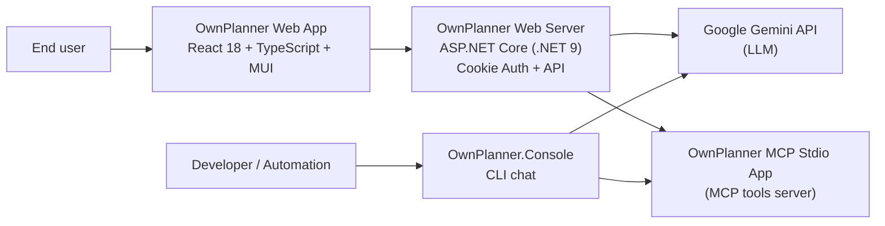
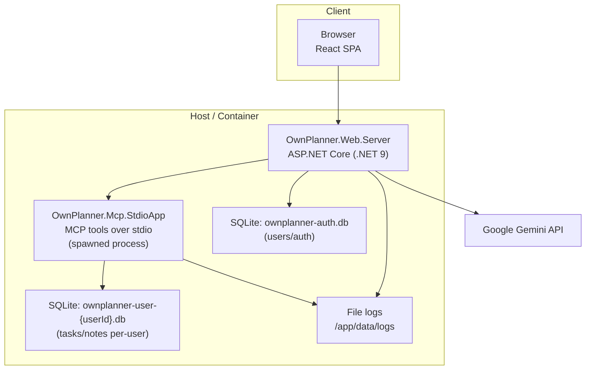
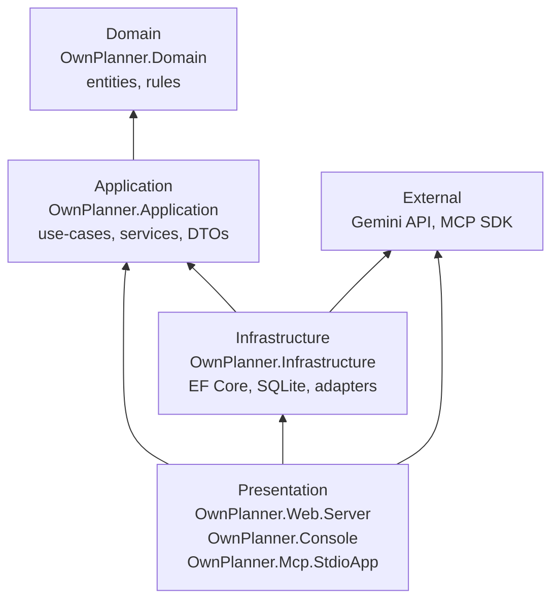
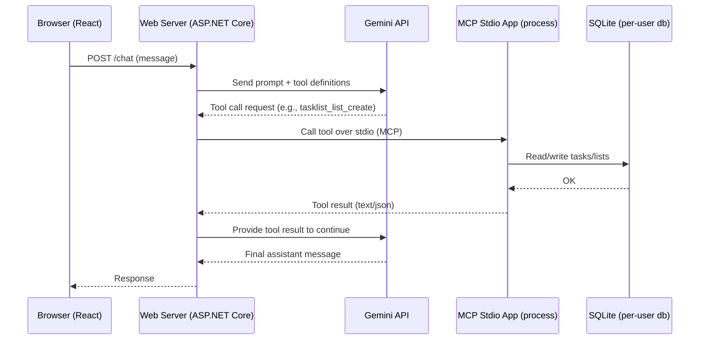

# OwnPlanner

An AI-powered personal planning assistant that helps you manage tasks, notes, and stay organized with intelligent conversation.

## Demo

Web app: https://app.controlcode.space

## Architecture

The solution is organized as a layered .NET application with multiple entry points (Web, Console, MCP) and an AI chat workflow that can invoke MCP tools.

### System Context (C4 L1)



### Containers & Data (C4 L2)



### Layered Code Structure



### Runtime: Chat + MCP tool call flow



## Solution Overview

OwnPlanner is a multi-project .NET 9 solution for personal planning and task management. It features a layered architecture and multiple interfaces:

- Core
  - **OwnPlanner.Application**: Core business logic, services, and DTOs.
  - **OwnPlanner.Domain**: Domain models and business rules.
  - **OwnPlanner.Application.Tests**, **OwnPlanner.Domain.Tests** : Unit tests for respective layers.
- Infrastructure
  - **OwnPlanner.Infrastructure**: Data persistence, external integrations, and infrastructure services.
  - **OwnPlanner.Infrastructure.Tests**: Integration tests for infrastructure.
- Presentation
  - **OwnPlanner.Web.Server**: ASP.NET Core 9 web server with React frontend for user interaction.
  - **OwnPlanner.Mcp.StdioApp**: MCP stdio adapter and developer tools for command-line or protocol-based automation.
  - **OwnPlanner.Console**: Console application for direct CLI usage.

Key features include:
- Layered architecture for maintainability and testability
- AI integration for intelligent planning
- Logging, error handling, and developer tooling
- Automated tests for core logic and infrastructure

## Built With

- Frontend: React 18 + TypeScript + Material-UI
- Backend: .NET 9 + ASP.NET Core
- AI: Google Gemini + Mscc.GenerativeAI SDK

## Run with OwnPlanner.Console

### Prerequisites

- .NET SDK 9
- A Google Gemini API key

### Configure

The console app loads settings from `appsettings.json` and `appsettings.Development.json` in the `OwnPlanner.Console` directory.

Required:

- `Gemini:ApiKey` (string)

Optional:

- `Gemini:Model` (string)
- `Gemini:MaxToolCallRounds` (number)

### Run

From the repo root:

```sh
dotnet run --project OwnPlanner.Console
```

Or from the project directory:

```sh
cd OwnPlanner.Console
dotnet run
```

Type `exit` to quit.