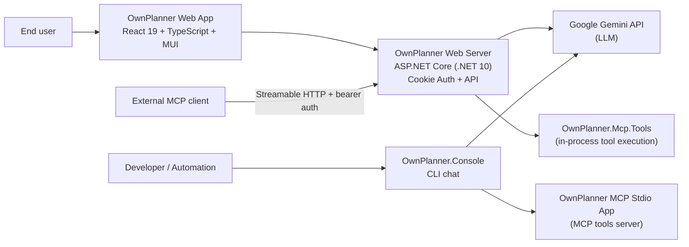
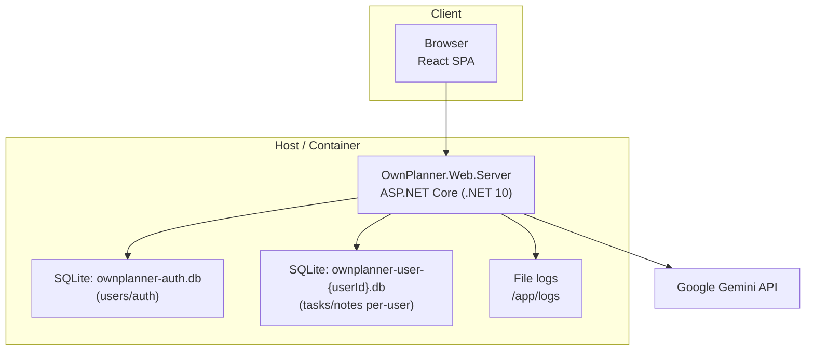
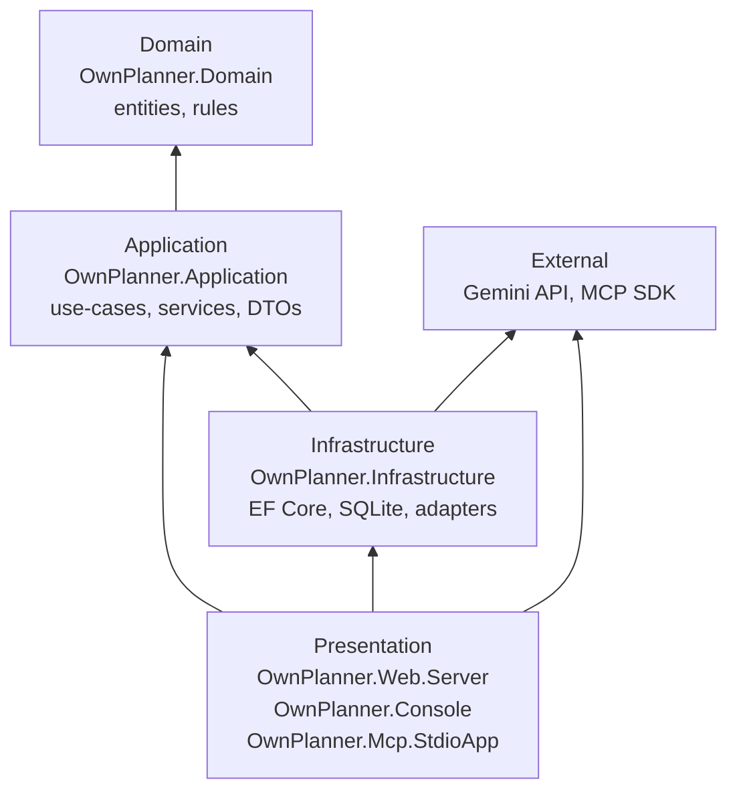
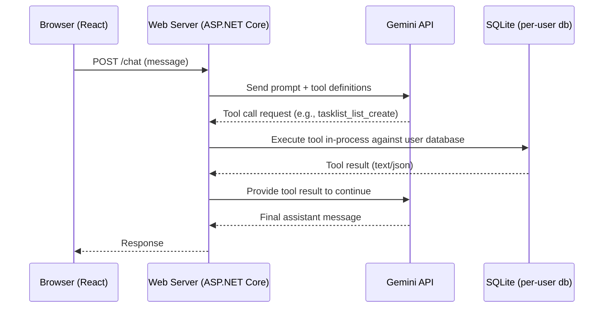

# OwnPlanner

A personal AI strategist & mentor. Goals-first planning: the assistant helps you
formulate goals and keeps daily work connected to them — tasks are the execution
mechanism, not the starting point. Built with .NET 10 and Model Context Protocol,
so any MCP-capable agent can operate the planner end to end.

## Demo

Web app: https://app.controlcode.space

## Architecture

The solution is organized as a layered .NET application with multiple entry points (Web, Console, MCP) and an AI chat workflow that can invoke MCP tools.

### System Context (C4 L1)


```mermaid
graph LR
  user["End user"] --> ui["OwnPlanner Web App<br/>React 19 + TypeScript + MUI"]
  ui --> web["OwnPlanner Web Server<br/>ASP.NET Core (.NET 10)<br/>Cookie Auth + API"]

  web --> llm["Google Gemini API<br/>(LLM)"]
  web --> tools["OwnPlanner.Mcp.Tools<br/>(in-process tool execution)"]

  dev["Developer / Automation"] --> console["OwnPlanner.Console<br/>CLI chat"]
  console --> llm
  console --> mcp["OwnPlanner MCP Stdio App<br/>(MCP tools server)"]

  client["External MCP client"] -->|"Streamable HTTP + bearer auth"| web
```

### Containers & Data (C4 L2)


```mermaid
graph TB
  subgraph client["Client"]
    browser["Browser<br/>React SPA"]
  end

  subgraph host["Host / Container"]
    web["OwnPlanner.Web.Server<br/>ASP.NET Core (.NET 10)"]
    authdb["SQLite: ownplanner-auth.db<br/>(users/auth)"]
    userdb["SQLite: ownplanner-user-{userId}.db<br/>(tasks/notes per-user)"]
    logs["File logs<br/>/app/logs"]
  end

  llm["Google Gemini API"]

  browser --> web
  web --> authdb
  web --> llm
  web --> userdb
  web --> logs
```

### Layered Code Structure


```mermaid
graph BT
  presentation["Presentation<br/>OwnPlanner.Web.Server<br/>OwnPlanner.Console<br/>OwnPlanner.Mcp.StdioApp"]
  infrastructure["Infrastructure<br/>OwnPlanner.Infrastructure<br/>EF Core, SQLite, adapters"]
  application["Application<br/>OwnPlanner.Application<br/>use-cases, services, DTOs"]
  domain["Domain<br/>OwnPlanner.Domain<br/>entities, rules"]
  external["External<br/>Gemini API, MCP SDK"]

  presentation --> application
  presentation --> infrastructure
  infrastructure --> application
  application --> domain
  infrastructure --> external
  presentation --> external
```

### Runtime: Chat + MCP tool call flow


```mermaid
sequenceDiagram
  participant B as Browser (React)
  participant W as Web Server (ASP.NET Core)
  participant G as Gemini API
  participant D as SQLite (per-user db)

  B->>W: POST /chat (message)
  W->>G: Send prompt + tool definitions
  G-->>W: Tool call request (e.g., tasklist_list_create)
  W->>D: Execute tool in-process against user database
  D-->>W: Tool result (text/json)
  W->>G: Provide tool result to continue
  G-->>W: Final assistant message
  W-->>B: Response
```

## Solution Overview

OwnPlanner is a multi-project .NET 10 solution for personal planning and task management. It features a layered architecture and multiple interfaces:

- Core
  - **OwnPlanner.Application**: Core business logic, services, and DTOs.
  - **OwnPlanner.Domain**: Domain models and business rules.
  - **OwnPlanner.Application.Tests**, **OwnPlanner.Domain.Tests** : Unit tests for respective layers.
- Infrastructure
  - **OwnPlanner.Infrastructure**: Data persistence, external integrations, and infrastructure services.
  - **OwnPlanner.Infrastructure.Tests**: Integration tests for infrastructure.
- Presentation
  - **OwnPlanner.Web.Server**: ASP.NET Core 10 web server with React frontend for user interaction.
  - **OwnPlanner.Mcp.StdioApp**: MCP stdio adapter and developer tools for command-line or protocol-based automation.
  - **OwnPlanner.Console**: Console application for direct CLI usage.
- Shared MCP tools
  - **OwnPlanner.Mcp.Tools**: Tool definitions and handlers reused by the web and stdio transports.
  - **OwnPlanner.Mcp.Tools.Tests**: Contract and behavior tests for shared MCP tools.

Key features include:
- Layered architecture for maintainability and testability
- AI integration for intelligent planning
- Logging, error handling, and developer tooling
- Automated tests for core logic and infrastructure

## Built With

- Frontend: React 19 + TypeScript + Material-UI
- Backend: .NET 10 + ASP.NET Core
- AI: Google Gemini + Mscc.GenerativeAI SDK

## Documentation

See [`docs/README.md`](docs/README.md) for current architecture and operations references, proposed
work, ADRs, and archived implementation plans.

## Release Notes

- Release builds are created from Git tags in the format `v<major>.<minor>.<patch>`, for example `v1.1.0`.
- Tagged builds publish the Docker image to `ghcr.io` with `v<version>`, `latest`, and commit SHA tags.
- Non-tagged builds still run restore, build, test, and Docker image build, but do not push an image.
- The same version is applied to `.NET` assembly metadata and embedded into the web app About dialog during the frontend build.

## Run with OwnPlanner.Console

### Prerequisites

- .NET SDK 10
- A Google Gemini API key

### Configure

The console app loads settings from `appsettings.json` and `appsettings.Development.json` in the `OwnPlanner.Console` directory.

Required:

- `Gemini:ApiKey` (string)

Optional:

- `Gemini:Model` (string)
- `Gemini:MaxToolCallRounds` (number)

### Run

From the repo root:

```sh
dotnet run --project OwnPlanner.Console
```

Or from the project directory:

```sh
cd OwnPlanner.Console
dotnet run
```

Type `exit` to quit.
